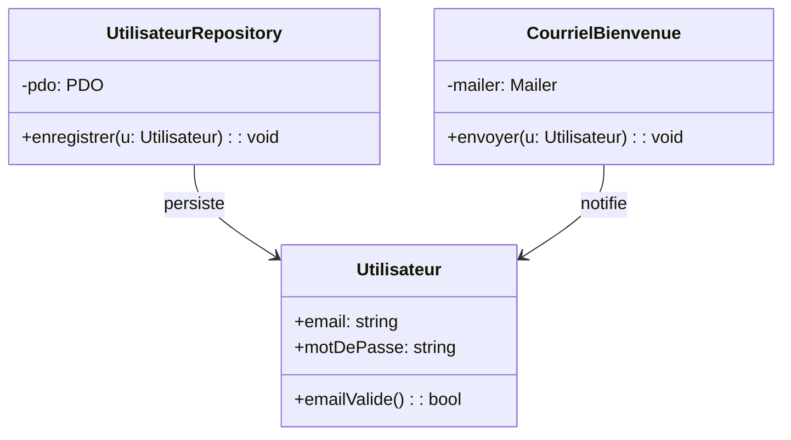
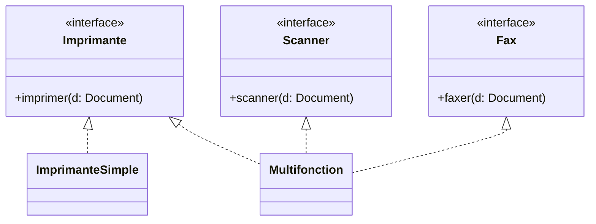

# [Tansoftware](https://www.tansoftware.com) - Les principes SOLID [](README.md)

[](LICENSE) [](#) [](#) [](#)

## Table des matières

- [Introduction](#introduction)
- [Glossaire — vocabulaire indispensable](#glossaire--vocabulaire-indispensable)
- [Single Responsibility Principle (SRP)](#single-responsibility-principle-srp)
- [Open/Closed Principle (OCP)](#openclosed-principle-ocp)
- [Liskov Substitution Principle (LSP)](#liskov-substitution-principle-lsp)
- [Interface Segregation Principle (ISP)](#interface-segregation-principle-isp)
- [Dependency Inversion Principle (DIP)](#dependency-inversion-principle-dip)
- [Couplage et cohésion — la métrique sous SOLID](#couplage-et-cohésion--la-métrique-sous-solid)
- [Composition plutôt qu'héritage](#composition-plutôt-quhéritage)
- [Tell-Don't-Ask — la conséquence pratique](#tell-dont-ask--la-conséquence-pratique)
- [Catalogue des anti-patrons OOP](#catalogue-des-anti-patrons-oop)
- [CUPID — l'alternative de Dan North](#cupid--lalternative-de-dan-north)
- [Pièges classiques et idées reçues](#pièges-classiques-et-idées-reçues)
- [La controverse — *« seul le S compte »*](#la-controverse--seul-le-s-compte)
- [Quand NE PAS appliquer SOLID](#quand-ne-pas-appliquer-solid)
- [Pour aller plus loin](#pour-aller-plus-loin)

## Introduction

L'acronyme SOLID a été forgé par Michael Feathers à partir des cinq principes de conception orientée objet rassemblés par [Robert C. Martin](http://cleancoder.com/products), alias *Uncle Bob*, dans son livre *[Agile Software Development: Principles, Patterns, and Practices](https://www.amazon.fr/Software-Development-Principles-Patterns-Practices/dp/0135974445)* (2002).

Chaque principe répond à un symptôme précis d'un code orienté objet difficile à maintenir : trop de raisons de changer (SRP), modifications qui rejaillissent partout (OCP), héritage qui casse les appelants (LSP), interfaces obèses (ISP), couplage à l'implémentation (DIP). L'ordre choisi n'est pas anodin : SRP fonde la notion de responsabilité que les principes suivants présupposent.

SOLID n'est pas une checklist à cocher mais une grille de lecture. Aucun de ces principes n'est une loi absolue : chacun coûte (en classes supplémentaires, en abstractions, en indirections) et rapporte (en stabilité, en testabilité, en autonomie d'évolution). Cette ressource présente d'abord le vocabulaire qui rend les définitions intelligibles, puis chaque principe avec sa formulation exacte, ses exemples PHP, ses pièges, et la situation où *ne pas* l'appliquer.

[🔝 Retour en haut de page](#table-des-matières)

## Glossaire — vocabulaire indispensable

Avant d'entrer dans les principes, voici les termes qu'ils mobilisent. Chaque définition est volontairement courte et orientée pratique.

### Abstraction

Représentation simplifiée d'un concept qui ne retient que ce qui intéresse les appelants et masque le reste. En POO, une abstraction prend la forme d'une **interface** ou d'une **classe abstraite**. *« Envoyer un courriel »* est une abstraction ; *« ouvrir un socket TCP sur le port 587, négocier STARTTLS, etc. »* est un détail d'implémentation.

### Interface

Contrat purement déclaratif : une liste de signatures de méthodes (nom, paramètres, type de retour, exceptions possibles) sans corps. Une classe qui *implémente* l'interface s'engage à fournir un comportement conforme à ce contrat. En PHP, mot-clé `interface` ; en Java, idem ; en C#, idem (avec `I` en préfixe par convention).

### Classe abstraite

Classe partiellement implémentée : elle peut contenir du code utile mais comporte au moins un membre laissé vide (méthode abstraite) que les sous-classes doivent compléter. On l'utilise pour factoriser un comportement commun (*template method*). Différence clé avec une interface : une classe ne peut hériter que d'**une seule** classe abstraite, alors qu'elle peut implémenter **plusieurs** interfaces.

### Héritage

Relation *est-un* : `Chien` hérite d'`Animal`. La sous-classe récupère la structure et le comportement de la classe mère et peut les redéfinir (`override`). L'héritage couple fortement les deux classes : tout changement dans la mère se propage. À utiliser avec parcimonie ; voir LSP pour les pièges.

### Composition

Relation *a-un* : `Voiture` a un `Moteur`. La voiture *contient* le moteur comme attribut, plutôt que d'en hériter. La composition se substitue souvent avantageusement à l'héritage car elle évite le couplage hiérarchique et permet de remplacer le composant à l'exécution. Adage : *« favor composition over inheritance »* (Gang of Four, 1994).

### Polymorphisme

Capacité d'une seule signature à recouvrir plusieurs comportements selon le type réel de l'objet. Quand on appelle `forme.aire()` sur une variable typée `Forme`, l'implémentation effectivement exécutée dépend du type concret (`Cercle`, `Rectangle`...). Le polymorphisme est le mécanisme qui rend OCP, LSP et DIP utilisables en pratique.

### Sous-typage

Relation formelle qui dit que tout objet du sous-type est *acceptable* partout où le supertype est attendu. C'est le sens technique de *« hérite de »* ou *« implémente »*. Le LSP impose une condition supplémentaire : le sous-typage doit aussi être *comportemental* (le sous-type ne ment pas sur le contrat).

### Contrat

Ensemble des engagements qu'une opération prend envers ses appelants. Il se compose de :
- **Préconditions** : ce que l'appelant doit garantir à l'entrée (ex. : argument non nul).
- **Postconditions** : ce que l'opération garantit à la sortie (ex. : la liste retournée est triée).
- **Invariants** : propriétés vraies avant et après chaque opération publique (ex. : le solde n'est jamais négatif).

Le terme vient de *Design by Contract* (Bertrand Meyer, langage Eiffel).

### Couplage

Degré de dépendance entre deux modules. Couplage *fort* : un changement dans A oblige à modifier B. Couplage *faible* : A et B communiquent par un contrat stable, et on peut changer l'un sans toucher l'autre. SOLID vise à abaisser le couplage là où il fait mal.

### Cohésion

Degré de parenté entre les éléments d'un même module. Cohésion *forte* : les méthodes d'une classe travaillent toutes sur les mêmes données pour un même but. Cohésion *faible* : la classe est un fourre-tout. Le SRP est, en pratique, un guide vers une forte cohésion.

### Covariance / contravariance

Comportement des types lorsque l'on raffine une signature en sous-classe.
- **Covariance** : le type de retour d'une méthode redéfinie peut être *plus précis* que dans la classe mère (un sous-type). Exemple : si `Animal::nourrir()` retourne `Animal`, `Vache::nourrir()` peut retourner `Vache`.
- **Contravariance** : le type d'un paramètre peut être *plus général* (un supertype) — rare en PHP/Java, autorisé pour rester compatible avec le LSP.

Règle mnémotechnique : *« on accepte plus, on rend moins »* — les paramètres se relâchent (contravariance), les retours se resserrent (covariance).

### Inversion de contrôle (IoC) et injection de dépendances (DI)

- **Inversion de contrôle** : le module n'instancie plus ses dépendances ; il les *reçoit*. C'est un principe.
- **Injection de dépendances** : la *technique* qui réalise l'IoC, généralement en passant les dépendances dans le constructeur (constructor injection), via un setter, ou via un conteneur DI.

À ne pas confondre avec le **DIP** : DIP parle de *qui dépend de quoi* (haut niveau, bas niveau, abstractions) ; DI parle de *comment* on fournit la dépendance.

### Les cinq sigles

- **SRP** — *Single Responsibility Principle* — une seule raison de changer.
- **OCP** — *Open/Closed Principle* — ouvert à l'extension, fermé à la modification.
- **LSP** — *Liskov Substitution Principle* — un sous-type doit honorer le contrat du parent.
- **ISP** — *Interface Segregation Principle* — pas de dépendance imposée à des méthodes inutilisées.
- **DIP** — *Dependency Inversion Principle* — dépendre d'abstractions, pas de détails.

[🔝 Retour en haut de page](#table-des-matières)

## Single Responsibility Principle (SRP)

> *« Une classe ne doit avoir qu'une seule raison de changer. »* — Robert C. Martin

### La définition exacte (et pourquoi elle est mal lue)

La lecture populaire est *« une classe ne doit faire qu'une seule chose »*. Cette formulation est fausse, ou au mieux trompeuse : la plupart des classes utiles font *plusieurs choses* (un repository ouvre une transaction, sérialise des paramètres, exécute une requête, mappe le résultat). Ce que dit Martin est plus précis : **une classe ne doit avoir qu'une seule raison de changer**, c'est-à-dire répondre à un seul *acteur* — un seul groupe de parties prenantes susceptibles de demander une modification.

Reformulation tardive de Martin lui-même (dans *Clean Architecture*) : *« A module should be responsible to one, and only one, actor »*. L'« acteur » est typiquement une équipe, un département, un rôle métier. C'est l'**axe de changement** : si deux personnes très différentes peuvent vouloir modifier la même classe pour des raisons orthogonales, la classe a deux responsabilités.

### SRP n'est pas la cohésion

La cohésion mesure si les éléments d'une classe travaillent ensemble ; le SRP mesure s'ils changent ensemble. Une classe peut être très cohésive (toutes ses méthodes manipulent un `Client`) tout en violant le SRP (parce qu'elle mêle persistance, validation et formatage d'export, trois préoccupations qui évoluent à des rythmes différents et sous des autorités différentes). Le SRP est donc plus strict : il regarde le *moteur* de l'évolution, pas seulement la *parenté thématique* des méthodes.

### Trouver l'axe de changement — méthode pratique

Devant une classe suspecte, posez les questions :
1. *Qui* demanderait à modifier cette méthode ? (un nom de personne, d'équipe ou de département)
2. Si je liste ces *qui* pour chaque méthode, en obtient-on un seul ou plusieurs ?
3. Pour chaque méthode, quelle est la fréquence de changement et son origine (réglementaire, métier, technique, esthétique) ?

Si la réponse à (2) est *plusieurs*, séparer. Les axes typiques : *infrastructure* (DBA, ops), *communication* (marketing, mailing), *règles métier* (produit), *présentation* (UX), *conformité* (juridique, sécurité).

### À éviter

```php
class Utilisateur {
    public function __construct(public string $email, public string $motDePasse) {}

    public function enregistrer(): void {
        // accès à la base — concerne l'équipe infrastructure
        $pdo = new PDO('mysql:host=...;dbname=...');
        $pdo->prepare('INSERT INTO users ...')->execute([...]);
    }

    public function envoyerCourrielBienvenue(): void {
        // accès au SMTP — concerne l'équipe communication
        mail($this->email, 'Bienvenue', '...');
    }

    public function validerEmail(): bool {
        // règle métier — concerne l'équipe produit
        return filter_var($this->email, FILTER_VALIDATE_EMAIL) !== false;
    }
}
```

Trois acteurs (infrastructure, communication, produit) modifient la même classe. Toute évolution du SMTP impose de retester la persistance, et la moindre règle de validation oblige à redéployer un objet qui touche la base.

### À préférer

```php
final class Utilisateur {
    public function __construct(public readonly string $email, public readonly string $motDePasse) {}
    public function emailValide(): bool {
        return filter_var($this->email, FILTER_VALIDATE_EMAIL) !== false;
    }
}

final class UtilisateurRepository {
    public function __construct(private PDO $pdo) {}
    public function enregistrer(Utilisateur $u): void { /* ... */ }
}

final class CourrielBienvenue {
    public function __construct(private Mailer $mailer) {}
    public function envoyer(Utilisateur $u): void { /* ... */ }
}
```

Chaque classe a un seul propriétaire et peut être modifiée sans craindre de casser les autres. Le test devient linéaire : on teste la persistance contre une base, la validation comme une fonction pure, l'envoi avec un *Mailer* en doublure.

### Quand assouplir

Pour un script utilitaire de quelques dizaines de lignes, multiplier les classes ajoute du bruit sans bénéfice. Le SRP devient rentable dès qu'une classe est touchée par plusieurs développeurs ou plusieurs équipes, ou que sa taille dépasse l'écran. Avant ce seuil, on accepte une classe *un peu trop large* pour rester lisible.



[🔝 Retour en haut de page](#table-des-matières)

## Open/Closed Principle (OCP)

> *« Une entité logicielle doit être ouverte à l'extension, fermée à la modification. »* — Bertrand Meyer (1988), repris par R. C. Martin.

### Lire la définition

*Ouverte à l'extension* : on doit pouvoir ajouter un comportement. *Fermée à la modification* : on n'a pas besoin de toucher au code existant pour le faire. La promesse n'est pas que le fichier ne change *jamais* (un correctif de bug reste légitime) mais qu'**ajouter un cas n'oblige pas à éditer ce qui marche déjà**.

Le mécanisme qui rend cela possible est le **polymorphisme** : on définit un point d'extension (interface ou classe abstraite) et chaque nouveau cas est une *nouvelle classe* implémentant ce point. Deux patrons en sont l'incarnation directe :
- **Strategy** : on substitue tout l'algorithme (`Forme::aire`).
- **Template Method** : on hérite d'un squelette et on redéfinit seulement les étapes variables.

### Pourquoi

Modifier une classe stable, c'est risquer de casser tout le code qui en dépendait. L'extension par polymorphisme isole le nouveau cas dans une nouvelle classe, ce qui rend le risque de régression strictement local au nouveau code.

### À éviter

```php
final class CalculAire {
    public function calculer(array $formes): float {
        $total = 0.0;
        foreach ($formes as $f) {
            if ($f instanceof Rectangle) {
                $total += $f->largeur * $f->hauteur;
            } elseif ($f instanceof Cercle) {
                $total += M_PI * $f->rayon ** 2;
            }
            // chaque nouvelle forme = nouveau elseif ici
        }
        return $total;
    }
}
```

Ajouter un triangle exige de modifier `CalculAire`, donc de retester ce qui marchait déjà. La cascade de `instanceof` est presque toujours le signe d'un OCP non appliqué.

### À préférer (interface — strategy)

```php
interface Forme {
    public function aire(): float;
}

final class Rectangle implements Forme {
    public function __construct(public float $largeur, public float $hauteur) {}
    public function aire(): float { return $this->largeur * $this->hauteur; }
}

final class Cercle implements Forme {
    public function __construct(public float $rayon) {}
    public function aire(): float { return M_PI * $this->rayon ** 2; }
}

final class Triangle implements Forme {
    public function __construct(public float $base, public float $hauteur) {}
    public function aire(): float { return $this->base * $this->hauteur / 2; }
}

final class CalculAire {
    /** @param Forme[] $formes */
    public function calculer(array $formes): float {
        return array_sum(array_map(fn(Forme $f) => $f->aire(), $formes));
    }
}
```

Ajouter une nouvelle forme se fait par une nouvelle classe ; `CalculAire` reste fermé.

### À préférer (classe abstraite — template method)

Lorsque les sous-classes partagent un *squelette* (ouverture transaction, logique commune, fermeture) mais varient sur une *étape*, une classe abstraite est plus économe :

```php
abstract class RapportPdf {
    final public function generer(string $cible): void {
        $this->ouvrir($cible);
        $this->ecrireEntete();
        $this->ecrireCorps();   // étape variable
        $this->ecrirePiedDePage();
        $this->fermer();
    }
    abstract protected function ecrireCorps(): void;
    protected function ecrireEntete(): void { /* défaut */ }
    protected function ecrirePiedDePage(): void { /* défaut */ }
    private function ouvrir(string $cible): void { /* ... */ }
    private function fermer(): void { /* ... */ }
}

final class RapportVentes extends RapportPdf {
    protected function ecrireCorps(): void { /* tableau des ventes */ }
}
```

Pour ajouter `RapportStock`, on hérite ; `RapportPdf` reste fermé.

### Quand assouplir

Anticiper toutes les extensions possibles produit des hiérarchies abstraites surdimensionnées. Le bon moment pour appliquer l'OCP est lors de la **deuxième** apparition d'un cas de variation, jamais du premier (cf. règle des trois usages de Martin Fowler). Dit autrement : on attend de voir l'axe de variation *réel* avant de figer un point d'extension. Un OCP appliqué à l'aveugle produit autant de dette qu'un OCP absent.

[🔝 Retour en haut de page](#table-des-matières)

## Liskov Substitution Principle (LSP)

> *« Si S est un sous-type de T, alors les objets de type T peuvent être remplacés par des objets de type S sans altérer les propriétés du programme. »* — Barbara Liskov (1987).

### Le contrat — formulation rigoureuse

Le LSP n'est pas une simple règle de compatibilité de types (le compilateur s'en charge déjà). C'est une règle de compatibilité **comportementale**. Pour que `S` puisse réellement se substituer à `T`, quatre conditions doivent tenir simultanément :

1. **Les préconditions ne peuvent pas être renforcées** dans le sous-type. Si `T::operation` accepte tout entier, `S::operation` ne peut pas exiger un entier strictement positif : un appelant qui passait `-3` à `T` casserait avec `S`.
2. **Les postconditions ne peuvent pas être affaiblies** dans le sous-type. Si `T::charger` garantit *« retourne une liste triée »*, `S::charger` ne peut pas retourner une liste non triée : un appelant qui comptait sur le tri serait pris en défaut.
3. **Les invariants de la classe mère doivent être préservés**. Si `CompteBancaire` invariant *« solde >= -plafondAutorisé »*, aucun sous-type ne peut autoriser un état plus permissif.
4. **La règle d'historique** (*history rule*, formulée par Liskov & Wing en 1994) : un sous-type ne doit pas autoriser des transitions d'état que le supertype interdisait. Exemple : si `PointImmuable::deplacer` n'existe pas, hériter pour ajouter une méthode mutante viole le LSP même si la signature reste compatible.

Côté typage statique, ces règles se traduisent par : paramètres **contravariants**, retours **covariants**, exceptions levées au plus aussi nombreuses que celles du parent.

### Pourquoi

Un appelant qui croit manipuler une `T` et reçoit une `S` doit pouvoir continuer son travail. Sinon, le polymorphisme devient un piège : chaque appelant doit tester *quel sous-type* il a vraiment, ce qui ramène le code à la cascade d'`instanceof` que l'OCP cherchait précisément à éviter.

### À éviter — l'archétype Carré/Rectangle

```java
class Rectangle {
    protected int largeur, hauteur;
    public void setLargeur(int l) { this.largeur = l; }
    public void setHauteur(int h) { this.hauteur = h; }
    public int aire() { return largeur * hauteur; }
}

class Carre extends Rectangle {
    @Override public void setLargeur(int l) { this.largeur = l; this.hauteur = l; }
    @Override public void setHauteur(int h) { this.largeur = h; this.hauteur = h; }
}
```

Test révélateur :

```java
void testRectangle(Rectangle r) {
    r.setLargeur(5);
    r.setHauteur(4);
    assertEquals(20, r.aire());
}

testRectangle(new Rectangle()); // OK
testRectangle(new Carre());     // Échoue : aire() = 16, pas 20
```

Analyse détaillée des violations :
- **Postcondition affaiblie** : après `setLargeur(5)`, `Rectangle` garantit *« largeur == 5 et hauteur inchangée »*. `Carre` casse la seconde moitié.
- **Invariant ajouté** : `Carre` impose `largeur == hauteur`, invariant absent du parent. Tout code qui comptait sur l'indépendance des deux dimensions est cassé.
- **Règle d'historique** : `Rectangle` autorisait la suite d'états *(5, 4)*. `Carre` rend cette suite inatteignable depuis `setLargeur` puis `setHauteur`. Une transition légitime du parent disparaît.

En théorie des ensembles, un carré est un rectangle ; en programmation, l'héritage d'implémentation introduit un couplage que la mathématique n'a pas. La leçon est plus large : *« est-un » dans le langage métier n'implique pas « est sous-type de »* au sens du LSP.

### À préférer

Soit on n'hérite pas (le carré n'est *pas* un rectangle modifiable), soit on rend les formes immuables — dans ce dernier cas il n'y a plus de mutateurs, donc plus de postcondition à casser :

```java
interface Forme { double aire(); }

record Rectangle(double largeur, double hauteur) implements Forme {
    public double aire() { return largeur * hauteur; }
}

record Carre(double cote) implements Forme {
    public double aire() { return cote * cote; }
}
```

L'immuabilité (records Java, classes `readonly` en PHP 8.2+) supprime de fait les violations historiques du LSP. C'est l'une des raisons pour lesquelles la programmation par objets-valeurs immuables est devenue dominante.

### Au-delà du carré/rectangle — exemples plus parlants

Le couple *Carré/Rectangle* est devenu si récurrent qu'il occulte d'autres violations plus instructives, qu'on rencontre tous les jours sans les voir.

#### L'autruche est-elle un oiseau ?

```php
abstract class Oiseau {
    abstract public function voler(): void;
}

final class Hirondelle extends Oiseau {
    public function voler(): void { /* ok */ }
}

final class Autruche extends Oiseau {
    public function voler(): void {
        throw new LogicException('Une autruche ne vole pas.');
    }
}
```

Une fonction `migrer(Oiseau $o) { $o->voler(); ... }` casse dès qu'on lui passe une `Autruche`. Le LSP est violé : la postcondition implicite *« après `voler()`, l'oiseau est en l'air »* ne tient plus. La correction n'est pas de retravailler la hiérarchie mais de **ségréguer par capacité** :

```php
interface OiseauVolant { public function voler(): void; }

final class Hirondelle implements OiseauVolant { public function voler(): void { /* ok */ } }
final class Autruche {
    public function courir(): void { /* ok */ }
}
```

L'autruche reste un oiseau au sens du domaine ; elle n'est plus *substituable* à un `OiseauVolant`. C'est le mariage typique LSP + ISP : on ne déclare la capacité que là où elle existe vraiment.

#### `ImmutableSet` étend-il `Set` ?

Plus subtil et omniprésent : on hérite d'une interface mutable pour fournir une version immuable.

```php
interface Ensemble {
    public function ajouter(mixed $element): void;
    public function contient(mixed $element): bool;
}

final class EnsembleImmuable implements Ensemble {
    public function __construct(private readonly array $elements) {}
    public function ajouter(mixed $element): void {
        throw new BadMethodCallException('Immuable');
    }
    public function contient(mixed $element): bool { return in_array($element, $this->elements, true); }
}
```

Tout client qui reçoit un `Ensemble` croit pouvoir lui ajouter un élément ; la version immuable lance une exception. Violation directe du LSP, et symptôme typique des bibliothèques de collections de la première génération (Java avant les `List.of(...)`). La solution propre : ne pas faire hériter `Immuable` de la version mutable, mais définir `EnsembleLecture` comme racine et `EnsembleMutable` comme sur-ensemble :

```php
interface EnsembleLecture {
    public function contient(mixed $element): bool;
    public function taille(): int;
}

interface EnsembleMutable extends EnsembleLecture {
    public function ajouter(mixed $element): void;
}
```

L'immuable implémente `EnsembleLecture` et rien d'autre ; il est *vraiment* substituable partout où la lecture seule suffit. C'est la trace la plus pure du LSP : la hiérarchie **suit les capacités**, pas la familiarité du nom.

#### Le compte bancaire et la *history rule*

```php
class CompteCourant {
    public function __construct(protected float $solde) {}
    public function deposer(float $m): void { $this->solde += $m; }
    public function retirer(float $m): void {
        if ($m > $this->solde) throw new DomainException('Solde insuffisant');
        $this->solde -= $m;
    }
}

class CompteEpargneBloque extends CompteCourant {
    public function retirer(float $m): void {
        throw new DomainException('Retraits bloqués jusqu\'à échéance.');
    }
}
```

Aucune signature ne change ; aucune précondition n'est *renforcée* explicitement. Pourtant, la **règle d'historique** est violée : le supertype autorisait la séquence d'états *(dépôt, retrait, dépôt, retrait)* ; le sous-type ne l'autorise plus. Tout code qui orchestrait des comptes en s'appuyant sur cette séquence est cassé. Le LSP n'est pas dans la signature, il est dans **les transitions d'état que les clients tenaient pour acquises**.

### Détecter une violation en revue

Indices fréquents :
- Un sous-type lance `UnsupportedOperationException` ou `null` là où le parent retournait une valeur.
- Un sous-type ajoute une vérification *« if (param == ...) throw »* en début de méthode redéfinie.
- Le code appelant fait `instanceof` pour distinguer les sous-types.
- Les tests d'intégration passent pour le parent mais échouent pour les enfants avec le *même scénario*.

### Quand assouplir

Le LSP ne s'applique pas si vous n'utilisez jamais le sous-type *via* le type parent (héritage purement structurant, sans polymorphisme à l'usage). C'est une situation rare et souvent un signal qu'une autre relation (composition, interface) serait plus juste. En pratique, dès qu'une variable typée du parent peut recevoir un enfant, le LSP s'applique sans exception.

[🔝 Retour en haut de page](#table-des-matières)

## Interface Segregation Principle (ISP)

> *« Aucun client ne devrait être forcé de dépendre de méthodes qu'il n'utilise pas. »* — R. C. Martin

### Lire la définition

L'ISP regarde l'interface du *côté du client*. La question n'est pas *« cette interface est-elle grosse ? »* mais *« chaque client utilise-t-il la totalité de ce qu'elle déclare ? »*. Une interface de 30 méthodes est acceptable si tous ses clients en consomment 30 ; une interface de 4 méthodes est obèse si un client n'en utilise que 1.

Mieux vaut donc plusieurs interfaces *cohérentes par rôle* qu'une grosse interface fourre-tout (*fat interface*). Une classe peut implémenter autant d'interfaces que nécessaire (PHP, Java, C# autorisent l'héritage multiple d'interfaces) : il n'y a pas de coût structurel à les multiplier raisonnablement.

### Pourquoi

Une classe qui implémente une interface obèse hérite de méthodes qu'elle n'a aucun moyen d'honorer. Les options sont toutes mauvaises :
- `UnsupportedOperationException` : violation directe du LSP.
- `null` ou valeur sentinelle : décale le bug à l'appelant.
- Implémentation vide silencieuse : faux positif au runtime.

Côté appelants, dépendre d'une interface trop large augmente le couplage à des évolutions qui ne les concernent pas : ajouter une méthode à l'interface oblige à recompiler/redéployer même les modules qui ne s'en servent pas.

### À éviter — interface obèse

```java
interface AppareilBureau {
    void imprimer(Document d);
    void scanner(Document d);
    void faxer(Document d);
}

class ImprimanteSimple implements AppareilBureau {
    public void imprimer(Document d) { /* ok */ }
    public void scanner(Document d)  { throw new UnsupportedOperationException(); }
    public void faxer(Document d)    { throw new UnsupportedOperationException(); }
}
```

`ImprimanteSimple` ment sur ses capacités ; tout code qui reçoit un `AppareilBureau` doit gérer l'éventualité d'une exception. C'est aussi une violation du LSP par contagion : `ImprimanteSimple` n'est pas un sous-type comportemental d'`AppareilBureau`.

### À préférer — interfaces ségrégées par *rôle*

```java
interface Imprimante { void imprimer(Document d); }
interface Scanner    { void scanner(Document d); }
interface Fax        { void faxer(Document d); }

class ImprimanteSimple implements Imprimante {
    public void imprimer(Document d) { /* ok */ }
}

class Multifonction implements Imprimante, Scanner, Fax {
    public void imprimer(Document d) { /* ok */ }
    public void scanner(Document d)  { /* ok */ }
    public void faxer(Document d)    { /* ok */ }
}
```

Chaque appelant ne dépend que de la capacité dont il a besoin : un service d'archivage prend `Scanner` en paramètre, un module d'impression prend `Imprimante`. Le multifonction sert tout le monde sans rien forcer.

### Variante PHP

```php
interface Imprimante { public function imprimer(Document $d): void; }
interface Scanner    { public function scanner(Document $d): Image; }
interface Fax        { public function faxer(Document $d, string $numero): void; }

final class ImprimanteSimple implements Imprimante {
    public function imprimer(Document $d): void { /* ... */ }
}

final class Multifonction implements Imprimante, Scanner, Fax {
    public function imprimer(Document $d): void { /* ... */ }
    public function scanner(Document $d): Image { /* ... */ }
    public function faxer(Document $d, string $numero): void { /* ... */ }
}
```

### Le piège inverse — l'explosion d'interfaces

Appliqué mécaniquement, l'ISP conduit à une interface par méthode (*« role interface taken to absurdity »*). Symptômes :
- Les implémentations cumulent dix interfaces alors qu'elles forment manifestement un même rôle métier.
- Les noms d'interfaces deviennent verbaux (`OrderSaver`, `OrderReader`, `OrderDeleter`...) là où `OrderRepository` couvrait le besoin.
- Les conteneurs DI explosent en bindings redondants.

La règle pratique : segmenter quand un *client réel* sous-utilise l'interface, ou quand deux groupes de méthodes évoluent à des rythmes différents. Ne pas segmenter par esthétique.

### Le bon mètre — *role interfaces* (Martin Fowler)

Fowler distingue deux familles d'interfaces :
- **Header interfaces** : on prend une classe existante et on en *extrait* l'ensemble de ses méthodes publiques pour en faire l'interface. Le nom évoque la *header* C : un duplicata structurel. Ces interfaces ont autant de méthodes que la classe et tendent vers la *fat interface*.
- **Role interfaces** : on déclare l'interface du *point de vue d'un appelant précis*, avec uniquement les méthodes que ce rôle consomme. Une classe peut implémenter plusieurs *role interfaces*, chacune correspondant à un contrat avec un type d'appelant.

Le bon mètre n'est donc pas *« combien de méthodes ? »* mais *« combien de rôles distincts cette interface mélange-t-elle ? »*. Une interface de douze méthodes peut être saine si elle correspond à un seul rôle ; une de trois méthodes est obèse si elle en mélange deux. C'est cette grille qui rend l'ISP utilisable sans tomber dans l'explosion d'interfaces : on dérive le découpage de la *forme du dialogue avec les clients*, pas d'une cardinalité.

### Quand assouplir

Sur de petits domaines stables, segmenter à l'extrême crée plus d'interfaces qu'il n'y a de classes ; on garde alors une seule interface tant que toutes les implémentations honorent réellement toutes les méthodes. Tant qu'aucun client n'est forcé à dépendre d'une méthode qu'il n'utilise pas, l'ISP est respecté — même avec une interface unique.



[🔝 Retour en haut de page](#table-des-matières)

## Dependency Inversion Principle (DIP)

> *« Les modules de haut niveau ne doivent pas dépendre des modules de bas niveau ; les deux doivent dépendre d'abstractions. »*
>
> *« Les abstractions ne doivent pas dépendre des détails ; les détails doivent dépendre des abstractions. »*

### Lire les deux règles

Le DIP énonce deux règles, pas une. La première inverse la flèche entre couches : sans DIP, le code métier *importe* les classes d'infrastructure (PDO, client HTTP, SDK SMTP). Avec DIP, le code métier définit lui-même l'abstraction dont il a besoin (une *interface de port*), et l'infrastructure vient se brancher dessus en l'implémentant. Les deux dépendent désormais de l'abstraction, mais c'est l'**infrastructure** qui dépend du domaine, pas l'inverse.

La seconde règle interdit qu'une abstraction soit polluée par des détails : une interface `CommandeRepository` ne doit pas exposer un `PDOStatement` dans sa signature, sinon on a juste déplacé le couplage. Une bonne abstraction n'est pas plus permissive que ce que tous ses implémenteurs peuvent honorer ; elle parle le langage du métier (commandes, clients, articles), pas celui de l'outillage (lignes, requêtes, connexions).

### DIP n'est pas DI

Confusion la plus fréquente :
- **DIP** est un *principe d'architecture* : où placer les flèches de dépendance, qui définit les abstractions, comment isoler le métier.
- **DI** (injection de dépendances) est une *technique* : passer une dépendance par le constructeur plutôt que de l'instancier soi-même.

On peut faire du DI sans respecter le DIP (par exemple en injectant une classe concrète d'infrastructure dans un service métier — la dépendance va dans le mauvais sens, même si elle est injectée). On peut respecter le DIP sans framework DI (en câblant manuellement les implémentations dans la racine de composition). Les deux sont complémentaires mais répondent à des questions différentes.

### Pourquoi

Sans DIP, changer de base de données, de file de messages ou de fournisseur SMS impose de modifier le code métier. Avec DIP, le métier reste stable ; on ne change qu'un *adapter* d'infrastructure. Le test devient possible sans MySQL ni SMTP : on injecte des doublures qui implémentent les mêmes interfaces. C'est la base de l'architecture *hexagonale* / *ports & adapters* (Alistair Cockburn) et de la *clean architecture* (Martin).

### À éviter

```php
final class ServiceCommande {
    public function passer(Commande $c): void {
        // dépendance directe à une implémentation concrète
        $pdo = new PDO('mysql:host=...;dbname=...');
        $pdo->prepare('INSERT INTO commandes ...')->execute([...]);

        $smtp = new \PHPMailer\PHPMailer\PHPMailer();
        $smtp->send();
    }
}
```

`ServiceCommande` est inutilisable sans MySQL ni PHPMailer, donc intestable sans eux. La flèche de dépendance va du domaine vers l'infrastructure : c'est l'inverse de ce que l'on veut.

### À préférer — abstraction définie par le domaine, injection par constructeur

```php
// Abstractions définies par le domaine
interface CommandeRepository {
    public function enregistrer(Commande $c): void;
}

interface NotificateurClient {
    public function confirmer(Commande $c): void;
}

// Module de haut niveau : ne connaît que les abstractions
final class ServiceCommande {
    public function __construct(
        private CommandeRepository $repository,
        private NotificateurClient $notificateur,
    ) {}

    public function passer(Commande $c): void {
        $this->repository->enregistrer($c);
        $this->notificateur->confirmer($c);
    }
}

// Détails d'infrastructure : implémentent les abstractions
final class CommandeRepositoryPdo implements CommandeRepository {
    public function __construct(private PDO $pdo) {}
    public function enregistrer(Commande $c): void { /* ... */ }
}

final class NotificateurClientSmtp implements NotificateurClient {
    public function __construct(private Mailer $mailer) {}
    public function confirmer(Commande $c): void { /* ... */ }
}
```

En tests, on injecte des doublures en mémoire ; en production, les implémentations concrètes. Le sens du couplage est inversé : c'est `CommandeRepositoryPdo` qui dépend de `CommandeRepository`, pas l'inverse.

### Câblage à la racine de composition

```php
// composition root (point d'entrée — controleur, container, bin/console...)
$pdo           = new PDO($dsn, $user, $pass);
$mailer        = new Mailer($smtpConfig);

$service = new ServiceCommande(
    new CommandeRepositoryPdo($pdo),
    new NotificateurClientSmtp($mailer),
);

$service->passer($commande);
```

La règle : **un seul endroit du code connaît les classes concrètes** — la racine de composition. Tout le reste manipule des interfaces.

### Quand assouplir

Pour du code utilitaire sans variation prévisible (parser de fichier, formatage de date, calcul mathématique pur), introduire une interface ne fait qu'ajouter une couche. Le DIP brille là où l'implémentation peut raisonnablement changer ou être remplacée par une doublure de test : persistance, communication réseau, horloge, génération aléatoire, accès au système de fichiers. Pour le reste, une dépendance directe à du code stable (la *standard library*, un calcul pur) ne fait de mal à personne.

[🔝 Retour en haut de page](#table-des-matières)

## Couplage et cohésion — la métrique sous SOLID

SOLID est un *moyen*, pas une *fin*. La fin que les cinq principes essaient d'atteindre tient en deux mots venus de Larry Constantine et Edward Yourdon dans les années 1970 : **couplage faible**, **cohésion forte**. Comprendre cette boussole, c'est cesser de réciter les principes et commencer à les juger.

### Couplage — neuf nuances de dépendance

Le couplage n'est pas binaire ; il y a une hiérarchie classique, du plus toxique au plus sain :

1. **Couplage de contenu** — un module modifie directement les variables internes d'un autre (équivalent du `friend` C++ poussé à l'extrême). Toxique.
2. **Couplage commun** — deux modules partagent des données globales mutables. Toxique : les changements deviennent imprévisibles.
3. **Couplage de contrôle** — A passe à B un *flag* qui change la branche d'exécution interne de B. Médiocre : B doit connaître les intentions de A.
4. **Couplage de timbre** *(stamp)* — A passe une grosse structure à B alors que B n'en utilise qu'un champ. Symptôme d'ISP non appliqué.
5. **Couplage de données** — A passe à B exactement les paramètres dont B a besoin. **Acceptable, voire idéal.**
6. **Couplage de message** — A et B ne dialoguent que par envoi de messages typés (objets-messages, événements). **Idéal.**

SOLID essaie globalement de pousser le code vers (5) et (6). DIP cible l'élimination du (1)/(2) entre couches ; ISP cible le (4) ; SRP réduit les couplages internes implicites (deux raisons de changer dans la même classe).

### Cohésion — sept nuances aussi

Symétriquement, sept niveaux de cohésion, du plus mauvais au meilleur :

1. **Cohésion fortuite** — les méthodes sont dans la même classe par accident historique.
2. **Cohésion logique** — *« toutes les opérations de validation »*, mais sur des objets différents.
3. **Cohésion temporelle** — *« tout ce qui se fait au démarrage »*.
4. **Cohésion procédurale** — étapes successives d'un même algorithme.
5. **Cohésion de communication** — les méthodes opèrent sur les mêmes données.
6. **Cohésion séquentielle** — la sortie d'une méthode est l'entrée de la suivante.
7. **Cohésion fonctionnelle** — toutes les méthodes contribuent à *une seule tâche bien définie*. **Idéal.**

Le SRP, lu correctement, vise la cohésion fonctionnelle alignée sur un *acteur* unique. Une classe qui n'a qu'une raison de changer mais quatre tâches indépendantes (cohésion logique) viole encore l'esprit du principe.

### La loi de Constantine

> *« Bon code = couplage faible entre modules, cohésion forte à l'intérieur. »*

C'est cette maxime que SOLID instrumente. Si une *application* d'un principe SOLID **augmente** le couplage ou **réduit** la cohésion, on l'applique mal — peu importe l'orthodoxie de la lecture. Le principe est subordonné à la métrique, pas l'inverse.

[🔝 Retour en haut de page](#table-des-matières)

## Composition plutôt qu'héritage

L'OOP des années 1990 (Java 1.0, premiers manuels Eiffel et Smalltalk) survalorisait l'héritage : *est-un* partout, hiérarchies à six niveaux, *frameworks* qui obligeaient à `extends` une classe de base pour tout. Trente ans plus tard, le verdict est tombé : **l'héritage profond est presque toujours une erreur**. Les bibliothèques modernes (Go, Rust, Kotlin, Swift, PHP moderne) misent sur les interfaces, traits, composition et délégation.

### Pourquoi l'héritage déçoit

- **Couplage maximal** : la sous-classe dépend de l'implémentation interne du parent, pas seulement de son contrat. Un changement dans le parent peut casser silencieusement les enfants (problème dit *fragile base class*).
- **Combinatoire impossible** : si on a `Oiseau`/`Mammifère` et `Volant`/`Nageur`/`Coureur`, l'héritage simple impose de choisir une seule dimension. Avec quatre dimensions à deux valeurs, on a 16 sous-classes potentielles.
- **Substitution risquée** : voir LSP. La majorité des violations LSP viennent d'un héritage forcé alors qu'une autre relation conviendrait.
- **Évolution unilatérale** : en composition, on peut changer un composant à l'exécution ; en héritage, jamais.

### Le test de l'« est-un » contre le test de l'« joue le rôle de »

Avant d'écrire `class B extends A`, posez-vous : *« B est-il intrinsèquement un A, ou B joue-t-il temporairement le rôle de A pour un certain client ? »*. Le second cas appelle une interface, pas un héritage. Une `EntréeJournal` peut *jouer le rôle* de `MessageHorodaté` sans en *être un*.

### Strategy par composition — l'exemple canonique

```php
// Anti-pattern : héritage pour varier l'algorithme
abstract class Tri {
    abstract public function trier(array $data): array;
}
final class TriRapide extends Tri { /* ... */ }
final class TriFusion extends Tri { /* ... */ }

class GestionnaireDocuments extends TriRapide { /* couplage figé à un tri précis */ }
```

```php
// Composition : on injecte la stratégie
interface Tri {
    public function trier(array $data): array;
}

final class TriRapide implements Tri { /* ... */ }
final class TriFusion implements Tri { /* ... */ }

final class GestionnaireDocuments {
    public function __construct(private Tri $tri) {}
    public function indexer(array $documents): array {
        return $this->tri->trier($documents);
    }
}
```

On peut maintenant changer la stratégie de tri à l'exécution, la tester avec une stratégie factice, et `GestionnaireDocuments` ne dépend que d'un *contrat* — pas d'un parent.

### Délégation explicite — le *vrai* hello world OOP moderne

```php
final class JournalEvenements {
    public function __construct(private readonly Horloge $horloge) {}
    public function consigner(string $message): void {
        // on délègue au composant Horloge, on n'en hérite pas
        echo '[' . $this->horloge->maintenant()->format('c') . "] {$message}\n";
    }
}
```

`JournalEvenements` *a une* `Horloge` ; il n'en *est pas une*. On peut injecter une `HorlogeFigée` en test sans toucher au journal. Pas une seule ligne d'héritage.

### Quand l'héritage reste légitime

- **Template Method** très restreint : le squelette est *vraiment* invariant et seules une ou deux étapes varient. Et encore, la plupart de ces cas se ramènent à une fonction d'ordre supérieur.
- **Sous-typage strict d'un type valeur immuable** où le LSP est garanti par construction (records, enums avec méthodes).
- **Contraintes de framework** : certains frameworks imposent `extends` (rare, mais ça arrive).

Adage à retenir : *« Préférer la composition à l'héritage »* (Gang of Four, 1994) — c'est le plus court résumé de SOLID lu honnêtement.

[🔝 Retour en haut de page](#table-des-matières)

## Tell-Don't-Ask — la conséquence pratique

> *« Tell, don't ask. »* — Alec Sharp, popularisé par Martin Fowler.

### Le principe

Au lieu de demander à un objet son état pour ensuite décider à sa place, on lui **dit ce qu'il faut faire** et on le laisse décider en interne. *Ask* casse l'encapsulation : on tire les données dehors, on raisonne ailleurs, on remet les données dedans. *Tell* respecte l'encapsulation : la décision reste collée aux données qu'elle concerne.

### Pourquoi c'est la conséquence directe de SOLID

- **SRP** — si la décision reste à l'extérieur, deux modules partagent la responsabilité (les données + la règle). Tell-Don't-Ask la concentre.
- **OCP** — l'ajout d'une nouvelle règle ne modifie pas l'appelant ; il enrichit l'objet ou son polymorphisme.
- **LSP** — on parle au contrat, pas aux internals : un sous-type peut redéfinir son comportement sans casser l'appelant.

### *Ask* — l'anti-patron

```php
final class Panier {
    /** @var Article[] */ public array $articles = [];
    public bool $promo = false;
}

// Logique métier dispersée dans l'appelant
function totalPanier(Panier $p): float {
    $total = 0.0;
    foreach ($p->articles as $a) {
        $total += $a->prix;
    }
    if ($p->promo) {
        $total *= 0.9;
    }
    return $total;
}
```

L'appelant interroge le panier (`$p->articles`, `$p->promo`), prend la décision (multiplier par 0.9), recompose. Si la promo passe à 8 %, ou s'ajoute une seconde règle (panier > 100 € = livraison gratuite), c'est l'appelant qui change. Les invariants ne sont protégés par personne.

### *Tell* — l'expression OOP

```php
final class Panier {
    /** @param Article[] $articles */
    public function __construct(
        private array $articles = [],
        private bool $promo = false,
    ) {}

    public function ajouter(Article $a): void { $this->articles[] = $a; }
    public function appliquerPromo(): void { $this->promo = true; }

    public function total(): float {
        $total = array_sum(array_map(fn(Article $a) => $a->prix, $this->articles));
        return $this->promo ? $total * 0.9 : $total;
    }
}

// Côté appelant — sans logique
$p->ajouter($article);
$p->appliquerPromo();
$facture = $p->total();
```

L'appelant *dit* (`appliquerPromo`, `ajouter`) puis *demande le résultat fini* (`total`). Toute évolution des règles reste dans `Panier`. Les `instanceof`, les `if` portant sur l'état, les *getters* dépouillés s'évanouissent.

### Le pendant : *getters* sont parfois nécessaires

Tell-Don't-Ask n'interdit pas les *getters* — un objet doit pouvoir exposer ce qui sert à l'affichage, à la sérialisation, à la persistance. La règle est : **ne pas baser une décision métier sur le *getter* d'un autre objet**. Lecture pour communiquer, *tell* pour décider.

[🔝 Retour en haut de page](#table-des-matières)

## Catalogue des anti-patrons OOP

SOLID se comprend par contraste. Voici les anti-patrons les plus diagnostiqués en revue de code.

### God Class (classe-Dieu)

Une classe qui sait tout, fait tout, voit tout. Symptômes : 800+ lignes, 30+ méthodes publiques, dépendances vers la moitié du système. La *God Class* est l'incarnation de la violation simultanée de SRP, ISP et OCP. Refactoring : identifier les *acteurs* qui poussent au changement et extraire un module par acteur.

### Anaemic Domain Model (objet anémique)

Inverse symétrique de la God Class : des objets qui ne sont que des sacs à *getters/setters*, et toute la logique métier se trouve dans des *services* qui les manipulent de l'extérieur. Critique de Martin Fowler (*Anemic Domain Model*, 2003) : c'est *« procedural code masquerading as objects »*. Symptôme typique : un domaine de 200 *entités* et 200 *services*, avec zéro méthode métier dans les entités. Violation flagrante du Tell-Don't-Ask et, par ricochet, de l'encapsulation.

### Service Locator

Un objet global (souvent statique) à qui on demande ses dépendances : `ServiceLocator::get(MailerInterface::class)`. Symptômes : on ne peut plus lire la signature d'un constructeur pour savoir ce dont la classe dépend, les tests deviennent fragiles (état global), le DIP est masqué (on dépend de `ServiceLocator`, pas d'une abstraction propre). Préférer toujours l'injection par constructeur.

### Singleton (mal utilisé)

Le Singleton n'est pas mauvais en soi (configuration immuable, registre de logger). Il devient toxique dès qu'il porte de l'**état mutable** : on a recréé une variable globale, déguisée. Le Singleton mutable casse les tests (impossible d'isoler), masque les dépendances (on ne voit pas qui s'en sert), bloque la parallélisation. Règle : si vous écrivez `Foo::getInstance()`, demandez-vous pourquoi vous ne passez pas `Foo` en argument.

### Smart UI / Presentation Heavy

Toute la logique métier vit dans le contrôleur ou la vue. *« On itère les commandes, on filtre celles qui datent de plus de 30 jours, on calcule le total, on affiche. »* Au moindre changement de règle, on cherche dans des templates. Antidote : remettre la logique sur les objets du domaine et faire de la vue un simple *renderer*.

### Feature Envy

Une méthode de la classe A passe son temps à appeler les *getters* de la classe B pour décider quelque chose. La méthode appartient en réalité à B (Tell-Don't-Ask). Refactoring : *Move Method* (Fowler).

### Shotgun Surgery

Le moindre changement métier oblige à toucher dix fichiers. Symptôme inverse de la God Class : la responsabilité est trop dispersée. Diagnostic souvent lié à un découpage horizontal (par couche technique) qui devrait être vertical (par cas d'usage).

### Refused Bequest

Un sous-type *refuse* l'héritage qu'il reçoit : il redéfinit la moitié des méthodes du parent en `throw new UnsupportedOperationException`. Signal qu'on a confondu *est-un* et *partage du code*. La composition ou une autre interface auraient été plus justes.

[🔝 Retour en haut de page](#table-des-matières)

## CUPID — l'alternative de Dan North

En 2022, Dan North (l'inventeur du *Behaviour-Driven Development*) propose **CUPID** comme alternative — ou plutôt complément — à SOLID, avec un parti pris : remplacer des règles structurelles par des *propriétés observables* d'un code agréable à utiliser.

| Lettre | Propriété             | Idée                                                                                |
| ------ | --------------------- | ----------------------------------------------------------------------------------- |
| **C**  | **Composable**        | Le module se branche facilement à d'autres ; petite surface, peu de prérequis.      |
| **U**  | **Unix-philosophy**   | Faire une chose, la faire bien ; produire des sorties consommables par d'autres.    |
| **P**  | **Predictable**       | Comportement déterministe, prévisible, observable ; pas d'effets de bord cachés.    |
| **I**  | **Idiomatic**         | Écrit dans le style attendu par le langage et l'écosystème (PSR en PHP, *go fmt*).  |
| **D**  | **Domain-based**      | La structure du code suit la structure du domaine, pas une architecture générique.  |

### Pourquoi CUPID intéresse même un partisan de SOLID

- **Propriétés vs règles** : SOLID dit *quoi faire* ; CUPID dit *à quoi ressemble* un bon code, en laissant le moyen ouvert.
- **Composable > Open/Closed** : on s'intéresse à la facilité d'agencement plutôt qu'à un point d'extension formel — souvent moins coûteux.
- **Predictable** intègre l'observabilité, les logs, les métriques — absents de SOLID.
- **Idiomatic** rappelle qu'un code SOLID *non-idiomatique* dans un écosystème lui fait plus de mal qu'un code moins SOLID mais lisible par tous.
- **Domain-based** rejoint le *Domain-Driven Design* (Eric Evans, 2003) : organiser par cas d'usage métier, pas par couche technique.

### Verdict honnête

CUPID ne remplace pas SOLID ; il l'enrobe et déplace l'attention. Un module peut respecter SOLID *sur le papier* et ne pas être *composable* (interfaces trop génériques, configuration intrusive). À l'inverse, un module *composable, prévisible, idiomatique* respecte de fait la majorité de SOLID sans qu'on ait besoin de réciter le mantra. À garder dans la boîte à outils intellectuelle, surtout en revue de bibliothèque ou de framework.

[🔝 Retour en haut de page](#table-des-matières)

## Pièges classiques et idées reçues

Une lecture rapide de SOLID conduit à des contresens qui font plus de mal que de bien. Les voici, principe par principe.

### SRP — *« faire une seule chose »*

C'est la déformation la plus répandue. *Faire une seule chose* est une consigne fonctionnelle (souvent dérivée du *Unix philosophy* appliqué aux fonctions) ; *avoir une seule raison de changer* est une consigne organisationnelle. Les deux peuvent coïncider, mais la première découpe par *verbe* (lire, valider, formater) tandis que la seule règle valable découpe par *acteur* (qui demande la modification ?). Conséquence : ne pas hacher une classe en micro-méthodes muettes au prétexte du SRP — ce qui compte est l'axe de changement.

### LSP — réduit à la compatibilité de signatures

Un compilateur vérifie déjà la compatibilité de types. Le LSP ajoute une couche **comportementale** : préconditions, postconditions, invariants, historique. Une sous-classe peut compiler et passer le typage tout en violant frontalement le LSP (le `Carre extends Rectangle` en est l'exemple canonique). Une revue LSP regarde les *garanties* du parent et vérifie que le sous-type ne les affaiblit pas.

### DIP — confondu avec DI

Voir la section dédiée plus haut. Symptôme : on injecte tout par constructeur en se croyant en règle, mais les services métier dépendent toujours de classes concrètes d'infrastructure. Le test reste impossible sans la base de données réelle. Tant que la flèche de dépendance n'est pas inversée *au niveau des types*, le DIP n'est pas appliqué — peu importe le mécanisme d'instanciation.

### ISP — segmenter à outrance

Une interface par méthode n'est pas l'objectif. L'objectif est qu'aucun client ne soit *forcé* de dépendre de ce qu'il n'utilise pas. Si tous les clients utilisent les sept méthodes d'une interface, segmenter en sept interfaces n'apporte rien et augmente le bruit. La granularité juste se mesure à *l'usage réel des clients*, pas à une règle de cardinalité.

### OCP — fermé pour de mauvaises raisons

Fermer une classe à toute modification, y compris aux corrections de bugs ou aux évolutions internes qui ne touchent pas son contrat, est une lecture intégriste. Le *fermé* du OCP signifie : *fermé pour ajouter des cas de variation prévus*. Refactoriser le corps d'une méthode sans changer son contrat n'est pas une violation de l'OCP. Idem, anticiper toutes les extensions imaginables produit des hiérarchies abstraites mort-nées : on attend la deuxième occurrence du besoin avant de figer un point d'extension.

[🔝 Retour en haut de page](#table-des-matières)

## La controverse — *« seul le S compte »*

Une critique récurrente, popularisée notamment par David Heinemeier Hansson (DHH, créateur de Ruby on Rails) et reprise par une partie du monde Python/Ruby, dit en substance : *« sur les cinq, seul le **S** survit à l'épreuve du quotidien ; les quatre autres sont soit triviaux, soit nocifs s'ils sont appliqués sans nuance »*. La position est trop tranchée pour être adoptée, mais elle mérite d'être prise au sérieux principe par principe.

### L'argument détaillé

- **SRP** est, en pratique, le seul des cinq dont l'absence se traduit *immédiatement* par une douleur observable : fichiers énormes, conflits de *merge*, peur d'éditer. Sa formulation *« une raison de changer »* survit à tous les paradigmes (procédural, OOP, fonctionnel).
- **OCP** est un idéal sur lequel l'expérience tempère l'enthousiasme. *On ne peut pas être ouvert à toutes les variations* (théorème d'impossibilité informel) ; on doit choisir *à quelle dimension* on veut être ouvert. Mal anticipée, l'abstraction crée plus de dette qu'elle n'en évite.
- **LSP** est un théorème, pas une heuristique : il dit ce que doit garantir un sous-typage correct. Mais il ne se *« suit »* pas activement — on ne décide pas chaque matin de respecter le LSP, on découvre une violation lors d'un bug.
- **ISP** se ramène, dans 90 % des projets de gestion modernes, à *« n'écrivez pas d'interface obèse »*. Une fois cette règle de bon sens absorbée, l'ISP n'apporte plus grand-chose au quotidien.
- **DIP** est puissant mais s'incarne déjà dans les pratiques courantes (DI par constructeur, ports/adapters). On peut faire excellent code en pensant *hexagonal* sans avoir jamais récité le DIP.

### Notre position

La caricature *« seul le S compte »* sert d'aiguillon utile : elle force à se demander *« quelle douleur précise est-ce que je soigne ? »* avant d'introduire une abstraction. Pour autant, les quatre autres principes ne sont pas redondants :

- **OCP** reste vital dans les *frameworks* et les bibliothèques destinés à des tiers.
- **LSP** reste indispensable dès qu'une hiérarchie sérieuse apparaît, et le simple fait de connaître la *history rule* évite des bugs subtils.
- **ISP** reste pertinent quand l'on conçoit l'interface d'un service partagé.
- **DIP** reste structurant pour quiconque vise une architecture testable.

Le bon résumé : SRP est le **principe que l'on applique tous les jours sans réfléchir** ; les quatre autres sont des **outils dont on connaît l'existence et qu'on dégaine quand le contexte les justifie**. Ce n'est pas la même chose que de les déclarer obsolètes.

[🔝 Retour en haut de page](#table-des-matières)

## Quand NE PAS appliquer SOLID

SOLID a un coût : classes supplémentaires, abstractions qui s'interposent, indirections que l'IDE doit franchir, dossiers qui se multiplient. Appliqué hors-sol, il produit la complexité qu'il prétendait éviter. Quelques cas où *ne pas* l'appliquer.

### Le code est jetable ou prototypal

Un script ETL ponctuel, un *spike* d'une journée pour explorer une API, un script d'administration utilisé deux fois par an : le code n'a pas vocation à durer ni à évoluer sous plusieurs autorités. Y appliquer SOLID coûte plus que le code lui-même.

### Le domaine est petit, stable et bien compris

Si la classe tient sur un écran et qu'aucune variation n'est anticipée, fragmenter en cinq classes pour respecter le SRP au pied de la lettre nuit à la lisibilité. La règle de **Sandi Metz** s'applique : *« make the change easy (warning: this may be hard), then make the easy change »* — n'introduire l'abstraction qu'au moment où le besoin de variation s'exprime, pas avant.

### La règle des trois usages (Fowler)

Tant qu'un cas de variation est unique, on l'écrit en dur. Au deuxième cas, on commence à voir l'axe de variation et on peut le coder un peu mieux. Au troisième, on extrait une abstraction. Refactoriser dès le premier cas, c'est se tromper d'axe de variation neuf fois sur dix.

### YAGNI et la critique de DHH

David Heinemeier Hansson (créateur de Ruby on Rails) a popularisé une critique pragmatique de SOLID : appliqué sans discernement à des applications de gestion classiques, il produit des couches de ports/adaptateurs/services pour rien, là où un *Active Record* direct fait le travail. Sa formule provocatrice — *« I won't be ridiculed by a Java enterprise architecture astronaut »* — vise l'usage rituel de SOLID, pas les principes eux-mêmes. La leçon : SOLID est un outil, pas une religion ; on l'invoque quand le couplage fait *concrètement* mal.

### Sur-ingénierie : les signaux d'alerte

- Plus d'interfaces que de classes qui les implémentent.
- Une seule implémentation par interface, sans intention de doublure de test ni de variante.
- Des classes minuscules dont les méthodes ne font qu'appeler la suivante, sans logique propre.
- Des hiérarchies abstraites prévues pour des cas qui ne se sont jamais matérialisés.
- Le temps de naviguer du contrôleur à l'effet réel (DB, HTTP, fichier) dépasse la durée de l'opération elle-même.

### Le bon réflexe

Quand on hésite à appliquer un principe, poser deux questions :
1. *Quel coût concret me fait éviter cette violation ?* (test difficile, déploiement bloqué, équipes qui se marchent dessus, fichier qui change quatre fois par sprint)
2. *Quel coût concret introduit l'abstraction que j'ajoute ?* (un fichier de plus, une indirection, un binding DI, une revue qui doit naviguer dans cinq fichiers)

Si la réponse à (1) reste théorique, on n'applique pas. SOLID rapporte exactement à hauteur de la douleur qu'il soigne ; en l'absence de douleur, c'est une charge nette.

[🔝 Retour en haut de page](#table-des-matières)

## Pour aller plus loin

- *Agile Software Development: Principles, Patterns, and Practices* — Robert C. Martin (livre fondateur)
- *Clean Architecture* — Robert C. Martin
- *Adaptive Code: Agile coding with design patterns and SOLID principles* — Gary McLean Hall
- *Practical Object-Oriented Design in Ruby* (POODR) — Sandi Metz (la référence sur le *« make the easy change easy »*)
- *Object-Oriented Software Construction* — Bertrand Meyer (origine du *Design by Contract* et de l'OCP)
- *Data Abstraction and Hierarchy* — Barbara Liskov, 1987 (papier d'origine du LSP)
- *A Behavioral Notion of Subtyping* — Liskov & Wing, 1994 (formalisation du LSP, règle d'historique)
- [SOLID Principles — Wikipedia](https://en.wikipedia.org/wiki/SOLID)
- [The Principles of OOD (Uncle Bob)](http://butunclebob.com/ArticleS.UncleBob.PrinciplesOfOod)
- [Refactoring Guru — Design Patterns](https://refactoring.guru/design-patterns)
- [Hexagonal Architecture — Alistair Cockburn](https://alistair.cockburn.us/hexagonal-architecture/)

## Licence

Distribué sous licence [MIT](LICENSE).

## Auteur

**Tansoftware - Tanguy Chénier** · [LinkedIn](https://www.linkedin.com/in/tanguy-chenier) · [Tan-Software](https://github.com/Tan-Software) · [Compte personnel (derniers outils)](https://github.com/tanguychenier) · [tansoftware.com](https://www.tansoftware.com)
