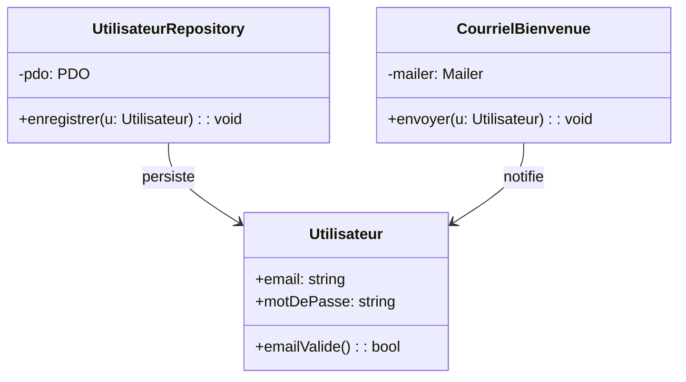
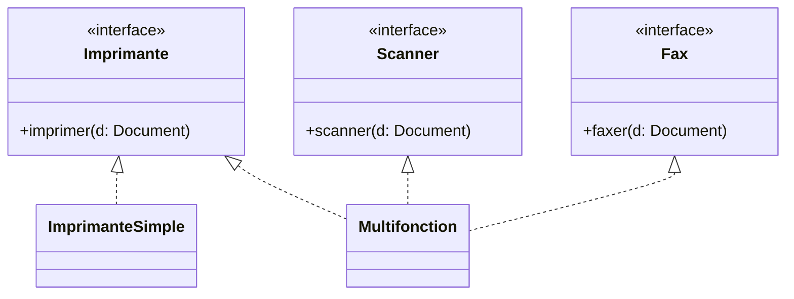

# [Tansoftware](https://www.tansoftware.com) - Les principes SOLID [](README.md)

[](LICENSE) [](#) [](#) [](#)

## Table des matières

- [Introduction](#introduction)
- [Single Responsibility Principle (SRP)](#single-responsibility-principle-srp)
- [Open/Closed Principle (OCP)](#openclosed-principle-ocp)
- [Liskov Substitution Principle (LSP)](#liskov-substitution-principle-lsp)
- [Interface Segregation Principle (ISP)](#interface-segregation-principle-isp)
- [Dependency Inversion Principle (DIP)](#dependency-inversion-principle-dip)
- [Pour aller plus loin](#pour-aller-plus-loin)

## Introduction

L'acronyme SOLID a été forgé par Michael Feathers à partir des cinq principes de conception orientée objet rassemblés par [Robert C. Martin](http://cleancoder.com/products), alias *Uncle Bob*, dans son livre *[Agile Software Development: Principles, Patterns, and Practices](https://www.amazon.fr/Software-Development-Principles-Patterns-Practices/dp/0135974445)* (2002).

Chaque principe répond à un symptôme précis d'un code orienté objet difficile à maintenir : trop de raisons de changer (SRP), modifications qui rejaillissent partout (OCP), héritage qui casse les appelants (LSP), interfaces obèses (ISP), couplage à l'implémentation (DIP). L'ordre choisi n'est pas anodin : SRP fonde la notion de responsabilité que les principes suivants présupposent.

[🔝 Retour en haut de page](#table-des-matières)

## Single Responsibility Principle (SRP)

> *« Une classe ne doit avoir qu'une seule raison de changer. »*

Le SRP demande qu'une classe ne réponde qu'à un seul *acteur* (un seul groupe de parties prenantes susceptibles de demander une modification). Il ne s'agit pas de « faire une seule chose » au sens fonctionnel, mais de **regrouper ce qui change pour la même raison et de séparer ce qui change pour des raisons différentes**.

### Pourquoi

Une classe qui sert deux acteurs subit deux flux de modifications indépendants ; les changements de l'un risquent de casser l'autre, et le test devient un casse-tête combinatoire.

### À éviter

```php
class Utilisateur {
    public function __construct(public string $email, public string $motDePasse) {}

    public function enregistrer(): void {
        // accès à la base — concerne l'équipe infrastructure
        $pdo = new PDO('mysql:host=...;dbname=...');
        $pdo->prepare('INSERT INTO users ...')->execute([...]);
    }

    public function envoyerCourrielBienvenue(): void {
        // accès au SMTP — concerne l'équipe communication
        mail($this->email, 'Bienvenue', '...');
    }

    public function validerEmail(): bool {
        // règle métier — concerne l'équipe produit
        return filter_var($this->email, FILTER_VALIDATE_EMAIL) !== false;
    }
}
```

Trois acteurs (infrastructure, communication, produit) modifient la même classe. Toute évolution du SMTP impose de retester la persistance.

### À préférer

```php
final class Utilisateur {
    public function __construct(public readonly string $email, public readonly string $motDePasse) {}
    public function emailValide(): bool {
        return filter_var($this->email, FILTER_VALIDATE_EMAIL) !== false;
    }
}

final class UtilisateurRepository {
    public function __construct(private PDO $pdo) {}
    public function enregistrer(Utilisateur $u): void { /* ... */ }
}

final class CourrielBienvenue {
    public function __construct(private Mailer $mailer) {}
    public function envoyer(Utilisateur $u): void { /* ... */ }
}
```

Chaque classe a un seul propriétaire et peut être modifiée sans craindre de casser les autres.

### Quand assouplir

Pour un script utilitaire de quelques dizaines de lignes, multiplier les classes ajoute du bruit sans bénéfice. Le SRP devient rentable dès qu'une classe est touchée par plusieurs développeurs ou plusieurs équipes.



[🔝 Retour en haut de page](#table-des-matières)

## Open/Closed Principle (OCP)

> *« Une entité logicielle doit être ouverte à l'extension, fermée à la modification. »* — Bertrand Meyer (1988), repris par R. C. Martin.

On doit pouvoir ajouter un comportement sans toucher au code existant et déjà testé. Le terme *open/closed* n'a pas d'équivalent français consacré ; on le conserve en italique.

### Pourquoi

Modifier une classe stable, c'est risquer de casser tout le code qui en dépendait. L'extension par polymorphisme isole le nouveau cas dans une nouvelle classe.

### À éviter

```php
final class CalculAire {
    public function calculer(array $formes): float {
        $total = 0.0;
        foreach ($formes as $f) {
            if ($f instanceof Rectangle) {
                $total += $f->largeur * $f->hauteur;
            } elseif ($f instanceof Cercle) {
                $total += M_PI * $f->rayon ** 2;
            }
            // chaque nouvelle forme = nouveau elseif ici
        }
        return $total;
    }
}
```

Ajouter un triangle exige de modifier `CalculAire`, donc de retester ce qui marchait déjà.

### À préférer

```php
interface Forme {
    public function aire(): float;
}

final class Rectangle implements Forme {
    public function __construct(public float $largeur, public float $hauteur) {}
    public function aire(): float { return $this->largeur * $this->hauteur; }
}

final class Cercle implements Forme {
    public function __construct(public float $rayon) {}
    public function aire(): float { return M_PI * $this->rayon ** 2; }
}

final class Triangle implements Forme {
    public function __construct(public float $base, public float $hauteur) {}
    public function aire(): float { return $this->base * $this->hauteur / 2; }
}

final class CalculAire {
    /** @param Forme[] $formes */
    public function calculer(array $formes): float {
        return array_sum(array_map(fn(Forme $f) => $f->aire(), $formes));
    }
}
```

Ajouter une nouvelle forme se fait par une nouvelle classe ; `CalculAire` reste fermé.

### Quand assouplir

Anticiper toutes les extensions possibles produit des hiérarchies abstraites surdimensionnées. Le bon moment pour appliquer l'OCP est lors de la **deuxième** apparition d'un cas de variation, jamais du premier (cf. règle des trois usages de Martin Fowler).

[🔝 Retour en haut de page](#table-des-matières)

## Liskov Substitution Principle (LSP)

> *« Si S est un sous-type de T, alors les objets de type T peuvent être remplacés par des objets de type S sans altérer les propriétés du programme. »* — Barbara Liskov (1987).

Une sous-classe doit respecter le **contrat** de sa classe mère : mêmes préconditions (au plus aussi exigeantes), mêmes postconditions (au moins aussi fortes), mêmes invariants.

### Pourquoi

Un appelant qui croit manipuler une `T` et reçoit une `S` doit pouvoir continuer son travail. Sinon, le polymorphisme devient un piège : chaque appelant doit tester *quel sous-type* il a vraiment.

### À éviter — l'archétype Carré/Rectangle

```java
class Rectangle {
    protected int largeur, hauteur;
    public void setLargeur(int l) { this.largeur = l; }
    public void setHauteur(int h) { this.hauteur = h; }
    public int aire() { return largeur * hauteur; }
}

class Carre extends Rectangle {
    @Override public void setLargeur(int l) { this.largeur = l; this.hauteur = l; }
    @Override public void setHauteur(int h) { this.largeur = h; this.hauteur = h; }
}
```

Test révélateur :

```java
void testRectangle(Rectangle r) {
    r.setLargeur(5);
    r.setHauteur(4);
    assertEquals(20, r.aire());
}

testRectangle(new Rectangle()); // OK
testRectangle(new Carre());     // Échoue : aire() = 16, pas 20
```

`Carre` casse une postcondition implicite (la largeur reste indépendante de la hauteur). En théorie des ensembles, un carré est un rectangle ; en programmation, l'héritage d'implémentation introduit un couplage que la mathématique n'a pas.

### À préférer

Soit on n'hérite pas (le carré n'est *pas* un rectangle modifiable), soit on rend les formes immuables :

```java
interface Forme { double aire(); }

record Rectangle(double largeur, double hauteur) implements Forme {
    public double aire() { return largeur * hauteur; }
}

record Carre(double cote) implements Forme {
    public double aire() { return cote * cote; }
}
```

### Quand assouplir

Le LSP ne s'applique pas si vous n'utilisez jamais le sous-type *via* le type parent (héritage purement structurant, sans polymorphisme à l'usage). C'est une situation rare et souvent un signal qu'une autre relation (composition, interface) serait plus juste.

[🔝 Retour en haut de page](#table-des-matières)

## Interface Segregation Principle (ISP)

> *« Aucun client ne devrait être forcé de dépendre de méthodes qu'il n'utilise pas. »*

Mieux vaut plusieurs petites interfaces ciblées qu'une grosse interface fourre-tout (*fat interface*).

### Pourquoi

Une classe qui implémente une interface obèse hérite de méthodes qu'elle n'a aucun moyen d'honorer (`UnsupportedOperationException`, `null`, exceptions silencieuses). Les appelants sont forcés de tester ce qu'ils peuvent ou non faire à l'exécution.

### À éviter — interface obèse

```java
interface AppareilBureau {
    void imprimer(Document d);
    void scanner(Document d);
    void faxer(Document d);
}

class ImprimanteSimple implements AppareilBureau {
    public void imprimer(Document d) { /* ok */ }
    public void scanner(Document d)  { throw new UnsupportedOperationException(); }
    public void faxer(Document d)    { throw new UnsupportedOperationException(); }
}
```

`ImprimanteSimple` ment sur ses capacités ; tout code qui reçoit un `AppareilBureau` doit gérer l'éventualité d'une exception.

### À préférer — interfaces ségrégées

```java
interface Imprimante { void imprimer(Document d); }
interface Scanner    { void scanner(Document d); }
interface Fax        { void faxer(Document d); }

class ImprimanteSimple implements Imprimante {
    public void imprimer(Document d) { /* ok */ }
}

class Multifonction implements Imprimante, Scanner, Fax {
    public void imprimer(Document d) { /* ok */ }
    public void scanner(Document d)  { /* ok */ }
    public void faxer(Document d)    { /* ok */ }
}
```

Chaque appelant ne dépend que de la capacité dont il a besoin.

### Quand assouplir

Sur de petits domaines stables, segmenter à l'extrême crée plus d'interfaces qu'il n'y a de classes ; on garde alors une seule interface tant que toutes les implémentations honorent réellement toutes les méthodes.



[🔝 Retour en haut de page](#table-des-matières)

## Dependency Inversion Principle (DIP)

> *« Les modules de haut niveau ne doivent pas dépendre des modules de bas niveau ; les deux doivent dépendre d'abstractions. »*
>
> *« Les abstractions ne doivent pas dépendre des détails ; les détails doivent dépendre des abstractions. »*

Le DIP renverse la flèche habituelle : au lieu que le code métier connaisse l'infrastructure, l'infrastructure implémente une abstraction définie *par* le métier.

### Pourquoi

Sans DIP, changer de base de données, de file de messages ou de fournisseur SMS impose de modifier le code métier. Avec DIP, le métier reste stable ; on ne change qu'une *adapter* d'infrastructure.

### À éviter

```php
final class ServiceCommande {
    public function passer(Commande $c): void {
        // dépendance directe à une implémentation concrète
        $pdo = new PDO('mysql:host=...;dbname=...');
        $pdo->prepare('INSERT INTO commandes ...')->execute([...]);

        $smtp = new \PHPMailer\PHPMailer\PHPMailer();
        $smtp->send();
    }
}
```

`ServiceCommande` est inutilisable sans MySQL ni PHPMailer, donc intestable sans eux.

### À préférer

```php
// Abstractions définies par le domaine
interface CommandeRepository {
    public function enregistrer(Commande $c): void;
}

interface NotificateurClient {
    public function confirmer(Commande $c): void;
}

// Module de haut niveau : ne connaît que les abstractions
final class ServiceCommande {
    public function __construct(
        private CommandeRepository $repository,
        private NotificateurClient $notificateur,
    ) {}

    public function passer(Commande $c): void {
        $this->repository->enregistrer($c);
        $this->notificateur->confirmer($c);
    }
}

// Détails d'infrastructure : implémentent les abstractions
final class CommandeRepositoryPdo implements CommandeRepository {
    public function __construct(private PDO $pdo) {}
    public function enregistrer(Commande $c): void { /* ... */ }
}
```

En tests, on injecte des doublures en mémoire ; en production, les implémentations concrètes. Le sens du couplage est inversé : c'est `CommandeRepositoryPdo` qui dépend de `CommandeRepository`, pas l'inverse.

### Quand assouplir

Pour du code utilitaire sans variation prévisible (parser de fichier, formatage de date), introduire une interface ne fait qu'ajouter une couche. Le DIP brille là où l'implémentation peut raisonnablement changer ou être remplacée par une doublure de test.

[🔝 Retour en haut de page](#table-des-matières)

## Pour aller plus loin

- *Agile Software Development: Principles, Patterns, and Practices* — Robert C. Martin (livre fondateur)
- *Clean Architecture* — Robert C. Martin
- *Adaptive Code: Agile coding with design patterns and SOLID principles* — Gary McLean Hall
- [SOLID Principles — Wikipedia](https://en.wikipedia.org/wiki/SOLID)
- [The Principles of OOD (Uncle Bob)](http://butunclebob.com/ArticleS.UncleBob.PrinciplesOfOod)
- [Refactoring Guru — Design Patterns](https://refactoring.guru/design-patterns)

## Licence

Distribué sous licence [MIT](LICENSE).

## Auteur

**Tansoftware - Tanguy Chénier** · [LinkedIn](https://www.linkedin.com/in/tanguy-chenier) · [Tan-Software](https://github.com/Tan-Software) · [Compte personnel (derniers outils)](https://github.com/tanguychenier) · [tansoftware.com](https://www.tansoftware.com)
