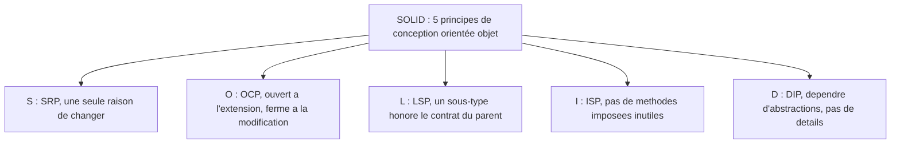

[↑ Sommaire](../README.md#table-des-matières) · [Responsabilité unique (SRP) →](02-responsabilite-unique-srp.md)

# 1. Fondations et vocabulaire

## Introduction

SOLID est un acronyme : chacune de ses cinq lettres est l'initiale d'un principe de conception logicielle. Il a été forgé par Michael Feathers à partir de cinq principes rassemblés par [Robert C. Martin](http://cleancoder.com/products), alias *Uncle Bob*, dans son livre *[Agile Software Development: Principles, Patterns, and Practices](https://www.amazon.fr/Software-Development-Principles-Patterns-Practices/dp/0135974445)* (2002).

> **Que veut dire « acronyme » ?** Un acronyme est un mot fabriqué avec la première lettre de plusieurs autres mots, pour qu'on le retienne plus facilement. Comme « OVNI » (Objet Volant Non Identifié). Ici, S-O-L-I-D résume cinq règles dont chaque lettre est le rappel d'une.

> **Que veut dire « conception orientée objet » ?** C'est une façon d'écrire un programme où l'on regroupe ensemble des données (par exemple le solde d'un compte) et les actions qui les manipulent (déposer, retirer) à l'intérieur d'un même « objet ». On parle aussi de POO (Programmation Orientée Objet), ou OOP en anglais (Object-Oriented Programming). C'est comme un appareil ménager : le four cache sa mécanique interne et n'expose que des boutons. SOLID donne des règles pour fabriquer de bons « objets » de ce genre.

Ces cinq principes répondent chacun à un symptôme précis d'un code orienté objet devenu difficile à maintenir : trop de raisons de changer (SRP), modifications qui rejaillissent partout (OCP), héritage qui casse les programmes qui s'en servent (LSP), interfaces surchargées (ISP), code dépendant de détails techniques (DIP). L'ordre des lettres n'est pas un hasard : SRP pose la notion de responsabilité que les quatre suivants supposent déjà connue.

SOLID n'est pas une liste de cases à cocher : c'est une grille de lecture. Aucun de ces principes n'est une loi absolue. Chacun a un coût (des classes supplémentaires, des abstractions, des indirections) et un bénéfice (de la stabilité, de la facilité à tester, une liberté d'évolution). On commence donc par le vocabulaire qui rend les définitions compréhensibles, puis on traite chaque principe avec sa formulation exacte, ses exemples en PHP, ses pièges et le moment où il vaut mieux ne pas l'appliquer.

> **Que veut dire « abstraction » et « indirection » ?** Une abstraction est une description simplifiée qui cache les détails (le mot « véhicule » au lieu de « moteur thermique à quatre cylindres »). Une indirection, c'est passer par un intermédiaire au lieu d'agir directement (téléphoner à un standard plutôt qu'à la personne). Les deux notions reviennent sans cesse dans SOLID.

[🔝 Retour en haut de page](#table-des-matières)

## Glossaire : vocabulaire indispensable

Les principes mobilisent un vocabulaire précis. Chaque définition ci-dessous reste courte et orientée pratique, avec une comparaison du quotidien.

### Abstraction

Représentation simplifiée d'un concept qui ne retient que ce qui intéresse celui qui s'en sert et masque le reste. En POO (Programmation Orientée Objet), une abstraction prend la forme d'une **interface** ou d'une **classe abstraite** (deux notions définies juste après). *« Envoyer un courriel »* est une abstraction ; *« ouvrir une connexion réseau sur le port 587, négocier le chiffrement, etc. »* est un détail d'implémentation.

> **Analogie.** Le mot « transport » est une abstraction : il vous dit qu'on va vous déplacer, sans préciser train, bus ou taxi. Vous raisonnez avec le mot « transport » sans avoir à connaître la mécanique de chaque véhicule.

> **Que veut dire « appelant » ?** L'appelant est le morceau de code qui se sert d'un autre morceau de code. Si la fonction A utilise la fonction B, alors A est l'appelant de B. Comme un client (appelant) qui passe commande à un serveur de restaurant (le code appelé).

### Interface

Contrat purement déclaratif : une liste de signatures de méthodes (le nom de chaque opération, ses paramètres, son type de retour, les erreurs possibles) sans le code qui les exécute. Une classe qui *implémente* l'interface s'engage à fournir un comportement conforme à ce contrat. En PHP comme en Java, c'est le mot-clé `interface` ; en C#, idem (avec un `I` en préfixe par convention).

> **Analogie.** Une interface est comme une fiche de poste : elle dit *« cette personne doit savoir cuisiner, servir, encaisser »* sans préciser *comment*. N'importe qui qui sait faire ces trois choses peut occuper le poste.

> **Que veut dire « méthode » et « signature » ?** Une méthode est une action qu'un objet sait faire (un verbe : `deposer`, `imprimer`). Sa signature est sa carte d'identité : son nom, ce qu'on lui donne en entrée et ce qu'elle renvoie. Comme la fiche d'un appareil qui indique les prises et les boutons sans montrer les circuits.

### Classe abstraite

Classe à moitié écrite : elle peut contenir du code utile mais comporte au moins une action laissée vide (méthode abstraite) que les classes filles devront compléter. On l'utilise pour mettre en commun un comportement partagé (le patron *template method*, vu plus loin). Différence clé avec une interface : une classe ne peut hériter que d'**une seule** classe abstraite, alors qu'elle peut implémenter **plusieurs** interfaces.

> **Analogie.** Une classe abstraite est une recette à trous : *« faire revenir les oignons, ajouter VOTRE viande, laisser mijoter »*. Le squelette est fourni, mais chaque cuisinier remplit le trou (la viande) à sa façon.

### Héritage

Relation *est-un* : `Chien` hérite d'`Animal` (un chien *est un* animal). La classe fille récupère la structure et le comportement de la classe mère et peut les redéfinir (en anglais `override`, « redéfinir par-dessus »). L'héritage lie fortement les deux classes : tout changement dans la mère se répercute sur les filles. À utiliser avec modération ; voir LSP pour les pièges.

> **Analogie.** L'héritage, c'est recevoir les traits de ses parents : vous tenez d'eux les yeux et la taille (la structure) et certaines habitudes (le comportement), que vous pouvez ensuite modifier un peu chez vous.

### Composition

Relation *a-un* : `Voiture` a un `Moteur` (une voiture *contient* un moteur, elle n'*est pas* un moteur). La voiture garde le moteur comme pièce interne, plutôt que d'en hériter. La composition remplace souvent avantageusement l'héritage : elle évite le lien hiérarchique rigide et permet d'échanger la pièce pendant que le programme tourne. Adage : *« favor composition over inheritance »* (préférez la composition à l'héritage), formule du collectif Gang of Four en 1994.

> **Analogie.** Une lampe *a* une ampoule : elle ne descend pas de l'ampoule, elle l'abrite. Vous changez l'ampoule sans changer la lampe. C'est tout l'intérêt de la composition.

> **Que veut dire « Gang of Four » ?** C'est le surnom de quatre auteurs (Gamma, Helm, Johnson, Vlissides) d'un livre fondateur de 1994 sur les « patrons de conception », des solutions toutes faites à des problèmes récurrents de code. « Gang des quatre » en français.

### Polymorphisme

Capacité d'une même demande à déclencher plusieurs comportements selon le type réel de l'objet. Quand on appelle `forme.aire()` sur une variable annoncée comme une `Forme`, le code réellement exécuté dépend du type concret derrière (`Cercle`, `Rectangle`...). Le polymorphisme est le mécanisme qui rend OCP, LSP et DIP utilisables en pratique.

> **Analogie.** Vous dites *« fais du bruit »* à un animal : le chien aboie, le chat miaule, le canard cancane. Une seule consigne, plusieurs réponses selon l'animal réel. C'est le polymorphisme (du grec *poly*, plusieurs, et *morphê*, forme).

### Sous-typage

Relation formelle qui dit que tout objet du sous-type est *acceptable* partout où le supertype est attendu. C'est le sens technique de *« hérite de »* ou *« implémente »*. Le LSP ajoute une condition : le sous-typage doit aussi être *comportemental* (le sous-type ne doit pas mentir sur le contrat).

> **Que veut dire « supertype » et « sous-type » ?** Le supertype est la catégorie large (`Animal`) ; le sous-type est la catégorie précise qui en relève (`Chien`). Un chien étant un animal, partout où l'on attend un animal, un chien fait l'affaire.

### Contrat

Ensemble des engagements qu'une opération prend envers ceux qui l'appellent. Il se compose de :
- **Préconditions** : ce que l'appelant doit garantir avant l'appel (par exemple : l'argument ne doit pas être vide).
- **Postconditions** : ce que l'opération garantit après coup (par exemple : la liste renvoyée est triée).
- **Invariants** : propriétés toujours vraies, avant et après chaque opération publique (par exemple : le solde ne devient jamais négatif).

Le terme vient de *Design by Contract* (« conception par contrat »), proposé par Bertrand Meyer avec le langage Eiffel.

> **Analogie.** Un contrat de livraison : vous devez fournir une adresse valide (précondition), le livreur garantit le colis intact avant 18 h (postcondition), et l'entrepôt promet de ne jamais perdre votre commande tout au long du processus (invariant).

### Couplage

Degré de dépendance entre deux modules. Couplage *fort* : un changement dans A oblige à modifier B. Couplage *faible* : A et B communiquent par un contrat stable, et on peut changer l'un sans toucher l'autre. SOLID cherche à réduire le couplage là où il fait mal.

> **Que veut dire « module » ?** Un module est un bloc de code regroupé en unité cohérente : une classe, un fichier, un paquet. Comme une pièce détachée d'une machine, qu'on peut considérer séparément.

> **Analogie.** Deux personnes fortement couplées finissent les phrases l'une de l'autre : si l'une change d'avis, l'autre est perdue. Faiblement couplées, elles s'échangent juste des messages clairs et restent autonomes.

### Cohésion

Degré de parenté entre les éléments d'un même module. Cohésion *forte* : les méthodes d'une classe travaillent toutes sur les mêmes données pour un même but. Cohésion *faible* : la classe est un fourre-tout. Le SRP est, en pratique, un guide vers une forte cohésion.

> **Analogie.** Une boîte à outils bien rangée où tout sert à réparer un vélo (cohésion forte) contre un tiroir fourre-tout où traînent un tournevis, un trombone et une pile usée (cohésion faible).

### Covariance / contravariance

Comportement des types quand on affine une signature dans une classe fille.
- **Covariance** : le type renvoyé par une méthode redéfinie peut être *plus précis* que dans la classe mère (un sous-type). Exemple : si `Animal::nourrir()` renvoie un `Animal`, `Vache::nourrir()` peut renvoyer une `Vache`.
- **Contravariance** : le type d'un paramètre peut être *plus général* (un supertype). C'est rare en PHP et Java, mais autorisé pour rester compatible avec le LSP.

Règle pour s'en souvenir : *« on accepte plus, on rend moins »*. Les paramètres se relâchent (contravariance), les retours se resserrent (covariance).

> **Analogie.** Un restaurant qui accepte plus de clients à l'entrée (contravariance) mais sert une assiette mieux définie à la sortie (covariance) reste compatible avec son ancienne carte : personne n'est pris au dépourvu.

### Inversion de contrôle (IoC) et injection de dépendances (DI)

> **Que veut dire « dépendance » ?** Une dépendance est un outil dont un morceau de code a besoin pour fonctionner (une connexion à la base de données, un service d'envoi d'e-mails). Comme un cuisinier qui dépend de son four : sans lui, pas de plat.

- **Inversion de contrôle** (IoC, de l'anglais *Inversion of Control*) : le module ne fabrique plus lui-même ses dépendances, il les *reçoit* de l'extérieur. C'est un principe.
- **Injection de dépendances** (DI, de l'anglais *Dependency Injection*) : la *technique* qui réalise l'IoC, le plus souvent en passant les dépendances dans le constructeur (injection par constructeur), via une méthode dédiée (*setter*), ou via un conteneur DI (un magasin central qui distribue les outils).

> **Analogie.** Au lieu d'aller fabriquer vous-même votre four (le module crée sa dépendance), on vous livre un four prêt à l'emploi dans votre cuisine (on vous l'injecte). Vous pouvez ainsi recevoir un vrai four, ou un faux four pour faire des essais sans cuisson.

À ne pas confondre avec le **DIP** : le DIP dit *qui dépend de quoi* (haut niveau, bas niveau, abstractions) ; la DI dit *comment* on fournit concrètement la dépendance.

### Les cinq sigles

> **Que veut dire « sigle » ?** Un sigle est une suite d'initiales qu'on lit lettre par lettre, comme SNCF. Les cinq sigles de SOLID résument chacun un principe :

- **SRP**, *Single Responsibility Principle* (principe de responsabilité unique) : une seule raison de changer.
- **OCP**, *Open/Closed Principle* (principe ouvert/fermé) : ouvert à l'extension, fermé à la modification.
- **LSP**, *Liskov Substitution Principle* (principe de substitution de Liskov) : un sous-type doit honorer le contrat du parent.
- **ISP**, *Interface Segregation Principle* (principe de ségrégation des interfaces) : aucune dépendance imposée à des méthodes inutilisées.
- **DIP**, *Dependency Inversion Principle* (principe d'inversion des dépendances) : dépendre d'abstractions, pas de détails.

[🔝 Retour en haut de page](#table-des-matières)

---

[↑ Sommaire](../README.md#table-des-matières) · [Responsabilité unique (SRP) →](02-responsabilite-unique-srp.md)
