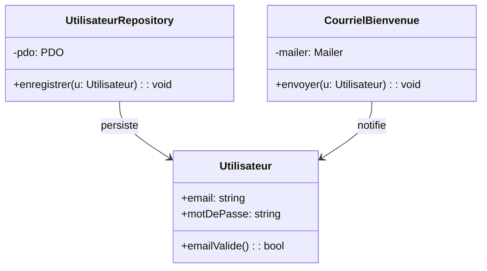

[← Fondations et vocabulaire](01-fondations-et-vocabulaire.md) · [↑ Sommaire](../README.md#table-des-matières) · [Ouvert/fermé (OCP) →](03-ouvertferme-ocp.md)

# 2. Responsabilité unique (SRP)

## Single Responsibility Principle (SRP)

> *« Une classe ne doit avoir qu'une seule raison de changer. »* (Robert C. Martin)

> **Que veut dire « classe » ?** Une classe est le moule à partir duquel on fabrique des objets. La classe `Voiture` décrit ce qu'est une voiture (ses données, ses actions) ; chaque voiture concrète sur la route est un objet issu de ce moule. C'est comme un plan d'architecte : un seul plan, plusieurs maisons construites dessus.

### La définition exacte (et pourquoi elle est mal lue)

La lecture populaire est *« une classe ne doit faire qu'une seule chose »*. Cette formulation est fausse, ou au mieux trompeuse : la plupart des classes utiles font *plusieurs choses* (un *repository* ouvre une transaction, prépare ses paramètres, exécute une requête, range le résultat). Ce que dit Martin est plus précis : **une classe ne doit avoir qu'une seule raison de changer**, autrement dit elle ne doit répondre qu'à un seul *acteur*, un seul groupe de personnes susceptibles d'en demander la modification.

> **Que veut dire « repository » ?** Un *repository* (« dépôt » en français) est l'objet chargé de ranger et de retrouver des données, en général dans une base. Comme un magasinier : on lui demande *« range ce dossier »* ou *« retrouve-moi le client n°42 »* sans savoir comment ses étagères sont organisées.

> **Que veut dire « acteur » ici ?** L'acteur est la personne ou le groupe qui pourrait réclamer un changement : une équipe, un service de l'entreprise, un rôle métier (le marketing, le juridique, la production). Demandez-vous toujours *« qui viendrait frapper à la porte pour faire modifier cette classe ? »*.

Reformulation plus tardive de Martin lui-même (dans *Clean Architecture*) : *« A module should be responsible to one, and only one, actor »* (un module ne doit rendre de comptes qu'à un seul acteur). C'est l'**axe de changement** : si deux personnes très différentes peuvent vouloir modifier la même classe pour des raisons sans rapport entre elles, la classe porte deux responsabilités.

### SRP n'est pas la cohésion

La cohésion mesure si les éléments d'une classe travaillent ensemble ; le SRP mesure s'ils changent ensemble. Une classe peut être très cohésive (toutes ses méthodes manipulent un `Client`) tout en violant le SRP (parce qu'elle mêle persistance, validation et formatage d'export, trois préoccupations qui évoluent à des rythmes différents et sous des autorités différentes). Le SRP est donc plus strict : il regarde le *moteur* de l'évolution, pas seulement la *parenté thématique* des méthodes.

### Trouver l'axe de changement : méthode pratique

Devant une classe suspecte, posez les questions :
1. *Qui* demanderait à modifier cette méthode ? (un nom de personne, d'équipe ou de département)
2. Si je liste ces *qui* pour chaque méthode, en obtient-on un seul ou plusieurs ?
3. Pour chaque méthode, quelle est la fréquence de changement et son origine (réglementaire, métier, technique, esthétique) ?

Si la réponse à (2) est *plusieurs*, séparer. Les axes typiques : *infrastructure* (DBA, ops), *communication* (marketing, mailing), *règles métier* (produit), *présentation* (UX), *conformité* (juridique, sécurité).

### À éviter

```php
class Utilisateur {
    public function __construct(public string $email, public string $motDePasse) {}

    public function enregistrer(): void {
        // accès à la base : concerne l'équipe infrastructure
        $pdo = new PDO('mysql:host=...;dbname=...');
        $pdo->prepare('INSERT INTO users ...')->execute([...]);
    }

    public function envoyerCourrielBienvenue(): void {
        // accès au SMTP : concerne l'équipe communication
        mail($this->email, 'Bienvenue', '...');
    }

    public function validerEmail(): bool {
        // règle métier : concerne l'équipe produit
        return filter_var($this->email, FILTER_VALIDATE_EMAIL) !== false;
    }
}
```

Trois acteurs (infrastructure, communication, produit) modifient la même classe. Toute évolution du SMTP impose de retester la persistance, et la moindre règle de validation oblige à redéployer un objet qui touche la base.

### À préférer

```php
final class Utilisateur {
    public function __construct(public readonly string $email, public readonly string $motDePasse) {}
    public function emailValide(): bool {
        return filter_var($this->email, FILTER_VALIDATE_EMAIL) !== false;
    }
}

final class UtilisateurRepository {
    public function __construct(private PDO $pdo) {}
    public function enregistrer(Utilisateur $u): void { /* ... */ }
}

final class CourrielBienvenue {
    public function __construct(private Mailer $mailer) {}
    public function envoyer(Utilisateur $u): void { /* ... */ }
}
```

Chaque classe a un seul propriétaire et peut être modifiée sans craindre de casser les autres. Le test devient linéaire : on teste la persistance contre une base, la validation comme une fonction pure, l'envoi avec un *Mailer* en doublure.

### Quand assouplir

Pour un script utilitaire de quelques dizaines de lignes, multiplier les classes ajoute du bruit sans bénéfice. Le SRP devient rentable dès qu'une classe est touchée par plusieurs développeurs ou plusieurs équipes, ou que sa taille dépasse l'écran. Avant ce seuil, on accepte une classe *un peu trop large* pour rester lisible.



[🔝 Retour en haut de page](#table-des-matières)

---

[← Fondations et vocabulaire](01-fondations-et-vocabulaire.md) · [↑ Sommaire](../README.md#table-des-matières) · [Ouvert/fermé (OCP) →](03-ouvertferme-ocp.md)
