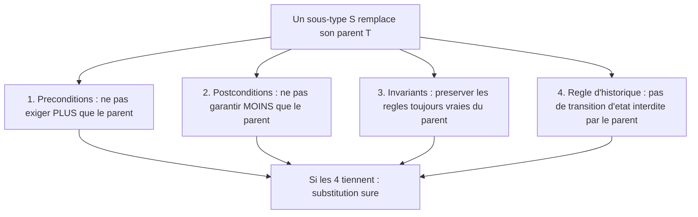

[← Ouvert/fermé (OCP)](03-ouvertferme-ocp.md) · [↑ Sommaire](../README.md#table-des-matières) · [Ségrégation des interfaces (ISP) →](05-segregation-des-interfaces-isp.md)

# 4. Substitution de Liskov (LSP)

## Liskov Substitution Principle (LSP)

> *« Si S est un sous-type de T, alors les objets de type T peuvent être remplacés par des objets de type S sans altérer les propriétés du programme. »* (Barbara Liskov, 1987.)

> **Qui est Barbara Liskov ?** Une informaticienne américaine, lauréate du prix Turing (l'équivalent du prix Nobel en informatique). Le principe porte son nom car elle l'a formulé. L'idée : remplacer un objet par un autre de la même famille ne doit rien casser.

> **Analogie.** Si une recette dit *« un fruit »*, remplacer la pomme par une poire ne doit pas faire échouer la recette. Si soudain on glisse un citron qui rend le gâteau immangeable, c'est que le « citron » ne respecte pas le contrat attendu d'un fruit dessert : voilà une violation à la Liskov.

### Le contrat : formulation rigoureuse

Le LSP n'est pas une simple règle de compatibilité de types (le compilateur s'en charge déjà). C'est une règle de compatibilité **comportementale**. Pour que `S` puisse réellement se substituer à `T`, quatre conditions doivent tenir simultanément :

1. **Les préconditions ne peuvent pas être renforcées** dans le sous-type. Si `T::operation` accepte tout entier, `S::operation` ne peut pas exiger un entier strictement positif : un appelant qui passait `-3` à `T` casserait avec `S`.
2. **Les postconditions ne peuvent pas être affaiblies** dans le sous-type. Si `T::charger` garantit *« retourne une liste triée »*, `S::charger` ne peut pas retourner une liste non triée : un appelant qui comptait sur le tri serait pris en défaut.
3. **Les invariants de la classe mère doivent être préservés**. Si `CompteBancaire` invariant *« solde >= -plafondAutorisé »*, aucun sous-type ne peut autoriser un état plus permissif.
4. **La règle d'historique** (*history rule*, formulée par Liskov & Wing en 1994) : un sous-type ne doit pas autoriser des transitions d'état que le supertype interdisait. Exemple : si `PointImmuable::deplacer` n'existe pas, hériter pour ajouter une méthode mutante viole le LSP même si la signature reste compatible.

Côté typage statique, ces règles se traduisent par : paramètres **contravariants**, retours **covariants**, exceptions levées au plus aussi nombreuses que celles du parent.



### Pourquoi

Un appelant qui croit manipuler une `T` et reçoit une `S` doit pouvoir continuer son travail. Sinon, le polymorphisme devient un piège : chaque appelant doit tester *quel sous-type* il a vraiment, ce qui ramène le code à la cascade d'`instanceof` que l'OCP cherchait précisément à éviter.

### À éviter : l'archétype Carré/Rectangle

```java
class Rectangle {
    protected int largeur, hauteur;
    public void setLargeur(int l) { this.largeur = l; }
    public void setHauteur(int h) { this.hauteur = h; }
    public int aire() { return largeur * hauteur; }
}

class Carre extends Rectangle {
    @Override public void setLargeur(int l) { this.largeur = l; this.hauteur = l; }
    @Override public void setHauteur(int h) { this.largeur = h; this.hauteur = h; }
}
```

Test révélateur :

```java
void testRectangle(Rectangle r) {
    r.setLargeur(5);
    r.setHauteur(4);
    assertEquals(20, r.aire());
}

testRectangle(new Rectangle()); // OK
testRectangle(new Carre());     // Échoue : aire() = 16, pas 20
```

Analyse détaillée des violations :
- **Postcondition affaiblie** : après `setLargeur(5)`, `Rectangle` garantit *« largeur == 5 et hauteur inchangée »*. `Carre` casse la seconde moitié.
- **Invariant ajouté** : `Carre` impose `largeur == hauteur`, invariant absent du parent. Tout code qui comptait sur l'indépendance des deux dimensions est cassé.
- **Règle d'historique** : `Rectangle` autorisait la suite d'états *(5, 4)*. `Carre` rend cette suite inatteignable depuis `setLargeur` puis `setHauteur`. Une transition légitime du parent disparaît.

En théorie des ensembles, un carré est un rectangle ; en programmation, l'héritage d'implémentation introduit un couplage que la mathématique n'a pas. La leçon est plus large : *« est-un » dans le langage métier n'implique pas « est sous-type de »* au sens du LSP.

### À préférer

Soit on n'hérite pas (le carré n'est *pas* un rectangle modifiable), soit on rend les formes immuables. Dans ce dernier cas, il n'y a plus de méthode pour changer les dimensions, donc plus de postcondition à casser :

> **Que veut dire « immuable » ?** Un objet immuable est un objet qu'on ne peut plus changer une fois créé, comme un ticket de caisse déjà imprimé. Si rien ne peut être modifié, aucun comportement modificateur ne peut trahir le contrat.

```java
interface Forme { double aire(); }

record Rectangle(double largeur, double hauteur) implements Forme {
    public double aire() { return largeur * hauteur; }
}

record Carre(double cote) implements Forme {
    public double aire() { return cote * cote; }
}
```

L'immuabilité (records Java, classes `readonly` en PHP 8.2+) supprime de fait les violations historiques du LSP. C'est l'une des raisons pour lesquelles la programmation par objets-valeurs immuables est devenue dominante.

### Au-delà du carré/rectangle : exemples plus parlants

Le couple *Carré/Rectangle* est devenu si récurrent qu'il occulte d'autres violations plus instructives, qu'on rencontre tous les jours sans les voir.

#### L'autruche est-elle un oiseau ?

```php
abstract class Oiseau {
    abstract public function voler(): void;
}

final class Hirondelle extends Oiseau {
    public function voler(): void { /* ok */ }
}

final class Autruche extends Oiseau {
    public function voler(): void {
        throw new LogicException('Une autruche ne vole pas.');
    }
}
```

Une fonction `migrer(Oiseau $o) { $o->voler(); ... }` casse dès qu'on lui passe une `Autruche`. Le LSP est violé : la postcondition implicite *« après `voler()`, l'oiseau est en l'air »* ne tient plus. La correction n'est pas de retravailler la hiérarchie mais de **ségréguer par capacité**, c'est-à-dire de séparer les rôles selon ce que chaque oiseau sait vraiment faire :

> **Que veut dire « ségréguer » ?** Ségréguer, c'est séparer en groupes distincts. Ici, on range d'un côté les oiseaux qui volent et de l'autre ceux qui courent, au lieu de tout mélanger. C'est exactement l'idée du principe ISP, vu plus loin.

```php
interface OiseauVolant { public function voler(): void; }

final class Hirondelle implements OiseauVolant { public function voler(): void { /* ok */ } }
final class Autruche {
    public function courir(): void { /* ok */ }
}
```

L'autruche reste un oiseau au sens du domaine ; elle n'est plus *substituable* à un `OiseauVolant`. C'est le mariage typique LSP + ISP : on ne déclare la capacité que là où elle existe vraiment.

#### `ImmutableSet` étend-il `Set` ?

Plus subtil et omniprésent : on hérite d'une interface mutable pour fournir une version immuable.

```php
interface Ensemble {
    public function ajouter(mixed $element): void;
    public function contient(mixed $element): bool;
}

final class EnsembleImmuable implements Ensemble {
    public function __construct(private readonly array $elements) {}
    public function ajouter(mixed $element): void {
        throw new BadMethodCallException('Immuable');
    }
    public function contient(mixed $element): bool { return in_array($element, $this->elements, true); }
}
```

Tout client qui reçoit un `Ensemble` croit pouvoir lui ajouter un élément ; la version immuable lance une exception. Violation directe du LSP, et symptôme typique des bibliothèques de collections de la première génération (Java avant les `List.of(...)`). La solution propre : ne pas faire hériter `Immuable` de la version mutable, mais définir `EnsembleLecture` comme racine et `EnsembleMutable` comme sur-ensemble :

```php
interface EnsembleLecture {
    public function contient(mixed $element): bool;
    public function taille(): int;
}

interface EnsembleMutable extends EnsembleLecture {
    public function ajouter(mixed $element): void;
}
```

L'immuable implémente `EnsembleLecture` et rien d'autre ; il est *vraiment* substituable partout où la lecture seule suffit. C'est la trace la plus pure du LSP : la hiérarchie **suit les capacités**, pas la familiarité du nom.

#### Le compte bancaire et la *history rule*

```php
class CompteCourant {
    public function __construct(protected float $solde) {}
    public function deposer(float $m): void { $this->solde += $m; }
    public function retirer(float $m): void {
        if ($m > $this->solde) throw new DomainException('Solde insuffisant');
        $this->solde -= $m;
    }
}

class CompteEpargneBloque extends CompteCourant {
    public function retirer(float $m): void {
        throw new DomainException('Retraits bloqués jusqu\'à échéance.');
    }
}
```

Aucune signature ne change ; aucune précondition n'est *renforcée* explicitement. Pourtant, la **règle d'historique** est violée : le supertype autorisait la séquence d'états *(dépôt, retrait, dépôt, retrait)* ; le sous-type ne l'autorise plus. Tout code qui orchestrait des comptes en s'appuyant sur cette séquence est cassé. Le LSP n'est pas dans la signature, il est dans **les transitions d'état que les clients tenaient pour acquises**.

### Détecter une violation en revue

Indices fréquents :
- Un sous-type lance `UnsupportedOperationException` ou `null` là où le parent retournait une valeur.
- Un sous-type ajoute une vérification *« if (param == ...) throw »* en début de méthode redéfinie.
- Le code appelant fait `instanceof` pour distinguer les sous-types.
- Les tests d'intégration passent pour le parent mais échouent pour les enfants avec le *même scénario*.

### Quand assouplir

Le LSP ne s'applique pas si vous n'utilisez jamais le sous-type *via* le type parent (héritage purement structurant, sans polymorphisme à l'usage). C'est une situation rare et souvent un signal qu'une autre relation (composition, interface) serait plus juste. En pratique, dès qu'une variable typée du parent peut recevoir un enfant, le LSP s'applique sans exception.

[🔝 Retour en haut de page](#table-des-matières)

---

[← Ouvert/fermé (OCP)](03-ouvertferme-ocp.md) · [↑ Sommaire](../README.md#table-des-matières) · [Ségrégation des interfaces (ISP) →](05-segregation-des-interfaces-isp.md)
