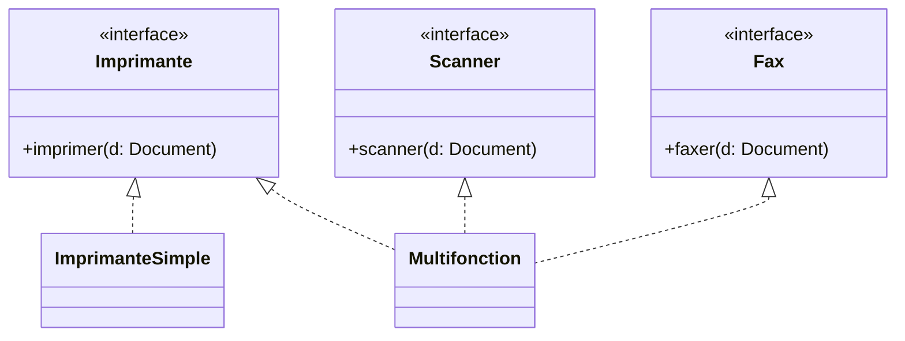

[← Substitution de Liskov (LSP)](04-substitution-de-liskov-lsp.md) · [↑ Sommaire](../README.md#table-des-matières) · [Inversion des dépendances (DIP) →](06-inversion-des-dependances-dip.md)

# 5. Ségrégation des interfaces (ISP)

## Interface Segregation Principle (ISP)

> *« Aucun client ne devrait être forcé de dépendre de méthodes qu'il n'utilise pas. »* (R. C. Martin)

> **Que veut dire « client » ici ?** Le client est le code qui se sert d'une interface (un synonyme d'« appelant »). Comme un usager qui n'utilise qu'un guichet d'une administration : pourquoi devrait-il connaître les vingt autres guichets qui ne le concernent pas ?

### Lire la définition

L'ISP regarde l'interface du *côté du client*. La question n'est pas *« cette interface est-elle grosse ? »* mais *« chaque client utilise-t-il la totalité de ce qu'elle déclare ? »*. Une interface de 30 méthodes est acceptable si tous ses clients en consomment 30 ; une interface de 4 méthodes est surchargée si un client n'en utilise qu'une.

Mieux vaut donc plusieurs interfaces *cohérentes par rôle* qu'une grosse interface fourre-tout (*fat interface*, « interface obèse »). Une classe peut implémenter autant d'interfaces que nécessaire (PHP, Java et C# autorisent l'héritage multiple d'interfaces) : multiplier les interfaces raisonnablement ne coûte rien à la structure du code.

> **Analogie.** Une télécommande universelle bourrée de 60 boutons (interface obèse) où vous n'en touchez que 3 vous oblige quand même à composer avec les 57 autres. Trois petites télécommandes claires, une par appareil, sont plus simples : chacun ne prend que celle dont il a besoin.

### Pourquoi

Une classe qui implémente une interface obèse hérite de méthodes qu'elle n'a aucun moyen d'honorer. Les options sont toutes mauvaises :
- `UnsupportedOperationException` : violation directe du LSP.
- `null` ou valeur sentinelle : décale le bug à l'appelant.
- Implémentation vide silencieuse : faux positif au runtime.

Côté appelants, dépendre d'une interface trop large augmente le couplage à des évolutions qui ne les concernent pas : ajouter une méthode à l'interface oblige à recompiler/redéployer même les modules qui ne s'en servent pas.

### À éviter : interface obèse

```java
interface AppareilBureau {
    void imprimer(Document d);
    void scanner(Document d);
    void faxer(Document d);
}

class ImprimanteSimple implements AppareilBureau {
    public void imprimer(Document d) { /* ok */ }
    public void scanner(Document d)  { throw new UnsupportedOperationException(); }
    public void faxer(Document d)    { throw new UnsupportedOperationException(); }
}
```

`ImprimanteSimple` ment sur ses capacités ; tout code qui reçoit un `AppareilBureau` doit gérer l'éventualité d'une exception. C'est aussi une violation du LSP par contagion : `ImprimanteSimple` n'est pas un sous-type comportemental d'`AppareilBureau`.

### À préférer : interfaces ségrégées par *rôle*

```java
interface Imprimante { void imprimer(Document d); }
interface Scanner    { void scanner(Document d); }
interface Fax        { void faxer(Document d); }

class ImprimanteSimple implements Imprimante {
    public void imprimer(Document d) { /* ok */ }
}

class Multifonction implements Imprimante, Scanner, Fax {
    public void imprimer(Document d) { /* ok */ }
    public void scanner(Document d)  { /* ok */ }
    public void faxer(Document d)    { /* ok */ }
}
```

Chaque appelant ne dépend que de la capacité dont il a besoin : un service d'archivage prend `Scanner` en paramètre, un module d'impression prend `Imprimante`. Le multifonction sert tout le monde sans rien forcer.

### Variante PHP

```php
interface Imprimante { public function imprimer(Document $d): void; }
interface Scanner    { public function scanner(Document $d): Image; }
interface Fax        { public function faxer(Document $d, string $numero): void; }

final class ImprimanteSimple implements Imprimante {
    public function imprimer(Document $d): void { /* ... */ }
}

final class Multifonction implements Imprimante, Scanner, Fax {
    public function imprimer(Document $d): void { /* ... */ }
    public function scanner(Document $d): Image { /* ... */ }
    public function faxer(Document $d, string $numero): void { /* ... */ }
}
```

### Le piège inverse : l'explosion d'interfaces

Appliqué mécaniquement, l'ISP conduit à une interface par méthode (*« role interface taken to absurdity »*). Symptômes :
- Les implémentations cumulent dix interfaces alors qu'elles forment manifestement un même rôle métier.
- Les noms d'interfaces deviennent verbaux (`OrderSaver`, `OrderReader`, `OrderDeleter`...) là où `OrderRepository` couvrait le besoin.
- Les conteneurs DI explosent en bindings redondants.

La règle pratique : segmenter quand un *client réel* sous-utilise l'interface, ou quand deux groupes de méthodes évoluent à des rythmes différents. Ne pas segmenter par esthétique.

### Le bon mètre : les *role interfaces* (Martin Fowler)

> **Qui est Martin Fowler ?** Un auteur britannique très influent sur la qualité du code, notamment sur le *refactoring* (l'art de réorganiser du code sans changer son comportement). Plusieurs notions de ce document viennent de lui.

Fowler distingue deux familles d'interfaces :
- **Header interfaces** (« interfaces en-tête ») : on prend une classe existante et on en *recopie* toutes les méthodes publiques pour en faire une interface. Le nom évoque le fichier *header* du langage C, un simple double structurel. Ces interfaces ont autant de méthodes que la classe et glissent vite vers l'interface obèse.
- **Role interfaces** (« interfaces de rôle ») : on déclare l'interface du *point de vue d'un appelant précis*, avec seulement les méthodes que ce rôle utilise. Une classe peut implémenter plusieurs interfaces de rôle, chacune correspondant à un contrat avec un type d'appelant.

Le bon mètre n'est donc pas *« combien de méthodes ? »* mais *« combien de rôles distincts cette interface mélange-t-elle ? »*. Une interface de douze méthodes peut être saine si elle correspond à un seul rôle ; une de trois méthodes est obèse si elle en mélange deux. C'est cette grille qui rend l'ISP utilisable sans tomber dans l'explosion d'interfaces : on dérive le découpage de la *forme du dialogue avec les clients*, pas d'une cardinalité.

### Quand assouplir

Sur de petits domaines stables, segmenter à l'extrême crée plus d'interfaces qu'il n'y a de classes ; on garde alors une seule interface tant que toutes les implémentations honorent réellement toutes les méthodes. Tant qu'aucun client n'est forcé de dépendre d'une méthode qu'il n'utilise pas, l'ISP est respecté, même avec une interface unique.



[🔝 Retour en haut de page](#table-des-matières)

---

[← Substitution de Liskov (LSP)](04-substitution-de-liskov-lsp.md) · [↑ Sommaire](../README.md#table-des-matières) · [Inversion des dépendances (DIP) →](06-inversion-des-dependances-dip.md)
