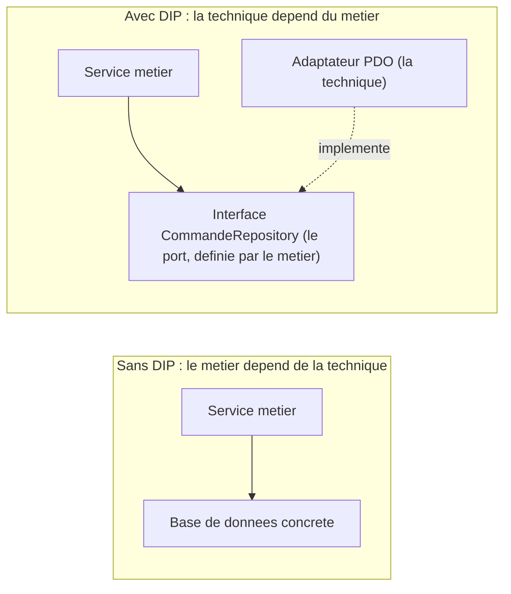

[← Ségrégation des interfaces (ISP)](05-segregation-des-interfaces-isp.md) · [↑ Sommaire](../README.md#table-des-matières) · [Principes et techniques connexes →](07-principes-et-techniques-connexes.md)

# 6. Inversion des dépendances (DIP)

## Dependency Inversion Principle (DIP)

> *« Les modules de haut niveau ne doivent pas dépendre des modules de bas niveau ; les deux doivent dépendre d'abstractions. »*
>
> *« Les abstractions ne doivent pas dépendre des détails ; les détails doivent dépendre des abstractions. »*

### Lire les deux règles

> **Que veut dire « haut niveau » et « bas niveau » ?** Le haut niveau, c'est le code des règles métier (que veut l'entreprise : passer une commande, calculer un prix). Le bas niveau, c'est la plomberie technique (parler à la base de données, envoyer un e-mail). Le haut niveau décide, le bas niveau exécute les détails.

Le DIP énonce deux règles, pas une. La première inverse la flèche entre les couches. Sans DIP, le code métier *importe* les classes techniques (la connexion à la base via PDO, le client HTTP, la bibliothèque d'envoi d'e-mails). Avec le DIP, le code métier définit lui-même l'abstraction dont il a besoin (une *interface de port*) et la technique vient se brancher dessus en l'implémentant. Les deux dépendent désormais de l'abstraction, mais c'est l'**infrastructure** qui dépend du métier, et non l'inverse.

> **Que veut dire « port » et « adaptateur » ?** Le port est la prise standardisée définie par le métier (par exemple : *« je veux pouvoir enregistrer une commande »*). L'adaptateur est la fiche concrète qui se branche sur ce port (par exemple : *« voici comment je l'enregistre vraiment dans MySQL »*). Comme une prise électrique murale (le port) et l'adaptateur de voyage que vous y enfichez (l'adaptateur) : changez de pays, vous changez d'adaptateur, jamais la prise du mur.

> **Que veut dire « infrastructure » et « domaine » ?** Le *domaine* est le cœur métier (les règles propres à votre activité). L'*infrastructure* regroupe les outils techniques autour (base de données, réseau, fichiers). On veut que l'infrastructure serve le domaine, pas que le domaine soit prisonnier d'un outil technique.

La seconde règle interdit qu'une abstraction soit polluée par des détails : une interface `CommandeRepository` ne doit pas faire apparaître un `PDOStatement` (un objet propre à la base de données) dans sa signature, sinon on a juste déplacé le couplage au lieu de le supprimer. Une bonne abstraction n'exige pas plus que ce que tous ceux qui l'implémentent peuvent tenir ; elle parle le langage du métier (commandes, clients, articles), pas celui de l'outillage (lignes, requêtes, connexions).

### DIP n'est pas DI

Confusion la plus fréquente :
- **DIP** est un *principe d'architecture* : où placer les flèches de dépendance, qui définit les abstractions, comment isoler le métier.
- **DI** (injection de dépendances) est une *technique* : passer une dépendance par le constructeur plutôt que de l'instancier soi-même.

On peut faire de la DI sans respecter le DIP (par exemple en injectant une classe technique concrète dans un service métier : la dépendance va dans le mauvais sens, même si elle est injectée). On peut respecter le DIP sans cadriciel de DI (en branchant les implémentations à la main dans la racine de composition). Les deux sont complémentaires mais répondent à des questions différentes.

> **Que veut dire « framework » (cadriciel) ?** Un *framework* (« cadriciel » en français) est une boîte à outils complète qui impose une organisation de départ et appelle votre code aux bons moments, comme un chef de chantier qui vous dit quand poser chaque brique. Symfony en PHP ou Ruby on Rails sont des frameworks.

> **Que veut dire « racine de composition » ?** C'est l'unique endroit du programme où l'on assemble les vraies pièces concrètes entre elles (au démarrage). Comme la table de montage d'une usine : tout le reste du code ne voit que des contrats, seule cette table connaît les vrais modèles.

### Pourquoi

Sans DIP, changer de base de données, de système de messagerie ou de fournisseur de SMS oblige à modifier le code métier. Avec le DIP, le métier reste stable ; on ne change qu'un *adaptateur* technique. Le test devient possible sans vraie base de données ni vrai serveur d'e-mail : on injecte des *doublures* qui implémentent les mêmes interfaces. C'est la base de l'architecture *hexagonale*, aussi appelée *ports & adapters* (« ports et adaptateurs », Alistair Cockburn), et de la *clean architecture* (« architecture propre », Martin).

> **Que veut dire « doublure » ?** Une doublure est un faux objet qui imite un vrai le temps d'un test, comme une doublure au cinéma remplace l'acteur pour une cascade. On l'utilise pour tester son code sans dépendre d'une vraie base de données.

> **Que veut dire « architecture hexagonale » ?** C'est une manière d'organiser un logiciel en mettant le métier au centre, entouré de « ports » par lesquels le monde extérieur communique avec lui. Le dessin se fait souvent sous forme d'hexagone, d'où le nom. L'idée : le cœur ne dépend de rien d'extérieur, c'est l'extérieur qui se branche au cœur.



### À éviter

```php
final class ServiceCommande {
    public function passer(Commande $c): void {
        // dépendance directe à une implémentation concrète
        $pdo = new PDO('mysql:host=...;dbname=...');
        $pdo->prepare('INSERT INTO commandes ...')->execute([...]);

        $smtp = new \PHPMailer\PHPMailer\PHPMailer();
        $smtp->send();
    }
}
```

`ServiceCommande` est inutilisable sans MySQL ni PHPMailer, donc intestable sans eux. La flèche de dépendance va du domaine vers l'infrastructure : c'est l'inverse de ce que l'on veut.

### À préférer : abstraction définie par le domaine, injection par constructeur

```php
// Abstractions définies par le domaine
interface CommandeRepository {
    public function enregistrer(Commande $c): void;
}

interface NotificateurClient {
    public function confirmer(Commande $c): void;
}

// Module de haut niveau : ne connaît que les abstractions
final class ServiceCommande {
    public function __construct(
        private CommandeRepository $repository,
        private NotificateurClient $notificateur,
    ) {}

    public function passer(Commande $c): void {
        $this->repository->enregistrer($c);
        $this->notificateur->confirmer($c);
    }
}

// Détails d'infrastructure : implémentent les abstractions
final class CommandeRepositoryPdo implements CommandeRepository {
    public function __construct(private PDO $pdo) {}
    public function enregistrer(Commande $c): void { /* ... */ }
}

final class NotificateurClientSmtp implements NotificateurClient {
    public function __construct(private Mailer $mailer) {}
    public function confirmer(Commande $c): void { /* ... */ }
}
```

En tests, on injecte des doublures en mémoire ; en production, les implémentations concrètes. Le sens du couplage est inversé : c'est `CommandeRepositoryPdo` qui dépend de `CommandeRepository`, pas l'inverse.

### Câblage à la racine de composition

```php
// composition root (point d'entrée : controleur, container, bin/console...)
$pdo           = new PDO($dsn, $user, $pass);
$mailer        = new Mailer($smtpConfig);

$service = new ServiceCommande(
    new CommandeRepositoryPdo($pdo),
    new NotificateurClientSmtp($mailer),
);

$service->passer($commande);
```

La règle : **un seul endroit du code connaît les classes concrètes**, la racine de composition. Tout le reste manipule des interfaces.

### Quand assouplir

Pour du code utilitaire sans variation prévisible (parser de fichier, formatage de date, calcul mathématique pur), introduire une interface ne fait qu'ajouter une couche. Le DIP brille là où l'implémentation peut raisonnablement changer ou être remplacée par une doublure de test : persistance, communication réseau, horloge, génération aléatoire, accès au système de fichiers. Pour le reste, une dépendance directe à du code stable (la *standard library*, un calcul pur) ne fait de mal à personne.

[🔝 Retour en haut de page](#table-des-matières)

---

[← Ségrégation des interfaces (ISP)](05-segregation-des-interfaces-isp.md) · [↑ Sommaire](../README.md#table-des-matières) · [Principes et techniques connexes →](07-principes-et-techniques-connexes.md)
