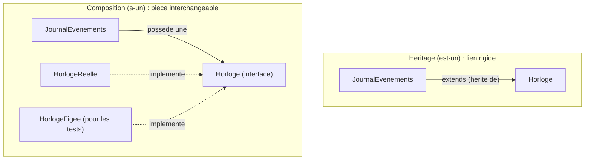

[← Inversion des dépendances (DIP)](06-inversion-des-dependances-dip.md) · [↑ Sommaire](../README.md#table-des-matières) · [Anti-patrons et alternatives →](08-anti-patrons-et-alternatives.md)

# 7. Principes et techniques connexes

## Couplage et cohésion : la métrique sous SOLID

SOLID est un *moyen*, pas une *fin*. Le but que les cinq principes cherchent à atteindre tient en deux mots venus de Larry Constantine et Edward Yourdon dans les années 1970 : **couplage faible**, **cohésion forte**. Comprendre cette boussole, c'est cesser de réciter les principes pour commencer à les juger.

### Couplage : neuf nuances de dépendance

Le couplage n'est pas tout ou rien ; il existe une échelle classique, du plus toxique au plus sain :

1. **Couplage de contenu** : un module modifie directement les variables internes d'un autre (l'équivalent de fouiller dans les tiroirs du voisin). Toxique.
2. **Couplage commun** : deux modules partagent des données globales modifiables. Toxique, car les changements deviennent imprévisibles.
3. **Couplage de contrôle** : A passe à B un *drapeau* (un indicateur) qui change le chemin d'exécution interne de B. Médiocre : B doit deviner les intentions de A.
4. **Couplage de timbre** *(stamp)* : A passe une grosse structure à B alors que B n'en utilise qu'un champ. Symptôme d'un ISP non appliqué.
5. **Couplage de données** : A passe à B exactement les paramètres dont B a besoin. **Acceptable, voire idéal.**
6. **Couplage de message** : A et B ne dialoguent que par envoi de messages bien définis (objets-messages, événements). **Idéal.**

SOLID pousse globalement le code vers les niveaux (5) et (6). Le DIP vise à éliminer les niveaux (1) et (2) entre couches ; l'ISP cible le (4) ; le SRP réduit les couplages internes cachés (deux raisons de changer dans la même classe).

### Cohésion : sept nuances aussi

Symétriquement, sept niveaux de cohésion, du plus mauvais au meilleur :

1. **Cohésion fortuite** : les méthodes se retrouvent dans la même classe par hasard de l'histoire.
2. **Cohésion logique** : *« toutes les opérations de validation »*, mais portant sur des objets différents.
3. **Cohésion temporelle** : *« tout ce qui se fait au démarrage »*.
4. **Cohésion procédurale** : étapes successives d'un même enchaînement.
5. **Cohésion de communication** : les méthodes opèrent sur les mêmes données.
6. **Cohésion séquentielle** : la sortie d'une méthode sert d'entrée à la suivante.
7. **Cohésion fonctionnelle** : toutes les méthodes concourent à *une seule tâche bien définie*. **Idéal.**

Le SRP, lu correctement, vise la cohésion fonctionnelle alignée sur un *acteur* unique. Une classe qui n'a qu'une raison de changer mais quatre tâches indépendantes (cohésion logique) viole encore l'esprit du principe.

### La loi de Constantine

> *« Bon code = couplage faible entre modules, cohésion forte à l'intérieur. »*

C'est cette maxime que SOLID met en pratique. Si l'*application* d'un principe SOLID **augmente** le couplage ou **réduit** la cohésion, c'est qu'on l'applique mal, peu importe la rigueur apparente de la lecture. Le principe est au service de la métrique, jamais l'inverse.

[🔝 Retour en haut de page](#table-des-matières)

## Composition plutôt qu'héritage

L'OOP des années 1990 (Java 1.0, premiers manuels Eiffel et Smalltalk) survalorisait l'héritage : *est-un* partout, hiérarchies à six niveaux, *frameworks* qui obligeaient à `extends` une classe de base pour tout. Trente ans plus tard, le verdict est tombé : **l'héritage profond est presque toujours une erreur**. Les bibliothèques modernes (Go, Rust, Kotlin, Swift, PHP moderne) misent sur les interfaces, traits, composition et délégation.

### Pourquoi l'héritage déçoit

- **Couplage maximal** : la classe fille dépend du fonctionnement interne du parent, pas seulement de son contrat. Un changement dans le parent peut casser silencieusement les enfants (problème dit *fragile base class*, « classe de base fragile » : toucher au socle fissure tout ce qui s'appuie dessus).
- **Combinatoire impossible** : si on a `Oiseau`/`Mammifère` et `Volant`/`Nageur`/`Coureur`, l'héritage simple impose de choisir une seule dimension. Avec quatre dimensions à deux valeurs, on a 16 sous-classes potentielles.
- **Substitution risquée** : voir LSP. La majorité des violations LSP viennent d'un héritage forcé alors qu'une autre relation conviendrait.
- **Évolution unilatérale** : en composition, on peut changer un composant à l'exécution ; en héritage, jamais.

### Le test de l'« est-un » contre le test de l'« joue le rôle de »

Avant d'écrire `class B extends A`, posez-vous : *« B est-il intrinsèquement un A, ou B joue-t-il temporairement le rôle de A pour un certain client ? »*. Le second cas appelle une interface, pas un héritage. Une `EntréeJournal` peut *jouer le rôle* de `MessageHorodaté` sans en *être un*.

### Strategy par composition : l'exemple canonique

```php
// Anti-pattern : héritage pour varier l'algorithme
abstract class Tri {
    abstract public function trier(array $data): array;
}
final class TriRapide extends Tri { /* ... */ }
final class TriFusion extends Tri { /* ... */ }

class GestionnaireDocuments extends TriRapide { /* couplage figé à un tri précis */ }
```

```php
// Composition : on injecte la stratégie
interface Tri {
    public function trier(array $data): array;
}

final class TriRapide implements Tri { /* ... */ }
final class TriFusion implements Tri { /* ... */ }

final class GestionnaireDocuments {
    public function __construct(private Tri $tri) {}
    public function indexer(array $documents): array {
        return $this->tri->trier($documents);
    }
}
```

On peut maintenant changer la stratégie de tri pendant que le programme tourne, la tester avec une stratégie factice, et `GestionnaireDocuments` ne dépend plus que d'un *contrat*, pas d'un parent.

### Délégation explicite : le *vrai* « bonjour le monde » de l'objet moderne

> **Que veut dire « déléguer » ?** Déléguer, c'est confier une tâche à quelqu'un d'autre dont c'est le métier, au lieu de la faire soi-même. Un objet qui *a* une horloge lui demande l'heure plutôt que d'essayer de la calculer lui-même.

```php
final class JournalEvenements {
    public function __construct(private readonly Horloge $horloge) {}
    public function consigner(string $message): void {
        // on délègue au composant Horloge, on n'en hérite pas
        echo '[' . $this->horloge->maintenant()->format('c') . "] {$message}\n";
    }
}
```

`JournalEvenements` *a une* `Horloge` ; il n'en *est pas une*. On peut injecter une `HorlogeFigée` en test sans toucher au journal. Pas une seule ligne d'héritage.



### Quand l'héritage reste légitime

- **Template Method** très restreint : le squelette est *vraiment* invariant et seules une ou deux étapes varient. Et encore, la plupart de ces cas se ramènent à une fonction d'ordre supérieur.
- **Sous-typage strict d'un type valeur immuable** où le LSP est garanti par construction (records, enums avec méthodes).
- **Contraintes de framework** : certains frameworks imposent `extends` (rare, mais ça arrive).

Adage à retenir : *« Préférer la composition à l'héritage »* (Gang of Four, 1994). C'est le plus court résumé de SOLID lu honnêtement.

[🔝 Retour en haut de page](#table-des-matières)

## Tell-Don't-Ask : la conséquence pratique

> *« Tell, don't ask. »* (Alec Sharp, popularisé par Martin Fowler.)

> **Que veut dire « Tell-Don't-Ask » ?** Mot à mot : *« ordonne, ne demande pas »*. Plutôt que de demander à un objet ses données pour décider à sa place, on lui *dit* quoi faire et on le laisse se débrouiller. Comme au restaurant : vous commandez un plat (vous *dites*), vous n'allez pas en cuisine sortir les ingrédients pour cuisiner vous-même (vous ne *demandez* pas les détails).

### Le principe

Au lieu de demander à un objet son état pour décider à sa place, on lui **dit ce qu'il faut faire** et on le laisse décider en interne. *Demander* (ask) casse l'encapsulation : on sort les données, on raisonne ailleurs, puis on remet les données en place. *Dire* (tell) respecte l'encapsulation : la décision reste collée aux données qu'elle concerne.

> **Que veut dire « encapsulation » ?** L'encapsulation, c'est garder les données d'un objet à l'intérieur de cet objet, derrière des actions bien définies, au lieu de les exposer en vrac. Comme un distributeur de billets : vous appuyez sur des boutons (les actions), vous ne plongez pas la main dans le coffre (les données).

### Pourquoi c'est la conséquence directe de SOLID

- **SRP** : si la décision reste à l'extérieur, deux modules se partagent la responsabilité (les données d'un côté, la règle de l'autre). Tell-Don't-Ask la regroupe.
- **OCP** : ajouter une nouvelle règle ne modifie pas l'appelant ; cela enrichit l'objet ou son polymorphisme.
- **LSP** : on parle au contrat, pas aux rouages internes ; un sous-type peut donc redéfinir son comportement sans casser l'appelant.

### *Ask* (demander) : l'anti-patron

> **Que veut dire « anti-patron » ?** Un anti-patron (en anglais *anti-pattern*) est une solution courante mais mauvaise, un piège dans lequel on tombe souvent. L'inverse d'un bon patron de conception.

```php
final class Panier {
    /** @var Article[] */ public array $articles = [];
    public bool $promo = false;
}

// Logique métier dispersée dans l'appelant
function totalPanier(Panier $p): float {
    $total = 0.0;
    foreach ($p->articles as $a) {
        $total += $a->prix;
    }
    if ($p->promo) {
        $total *= 0.9;
    }
    return $total;
}
```

L'appelant interroge le panier (`$p->articles`, `$p->promo`), prend la décision (multiplier par 0.9), recompose. Si la promo passe à 8 %, ou s'ajoute une seconde règle (panier > 100 € = livraison gratuite), c'est l'appelant qui change. Les invariants ne sont protégés par personne.

### *Tell* (dire) : l'expression objet

```php
final class Panier {
    /** @param Article[] $articles */
    public function __construct(
        private array $articles = [],
        private bool $promo = false,
    ) {}

    public function ajouter(Article $a): void { $this->articles[] = $a; }
    public function appliquerPromo(): void { $this->promo = true; }

    public function total(): float {
        $total = array_sum(array_map(fn(Article $a) => $a->prix, $this->articles));
        return $this->promo ? $total * 0.9 : $total;
    }
}

// Côté appelant : sans logique
$p->ajouter($article);
$p->appliquerPromo();
$facture = $p->total();
```

L'appelant *dit* (`appliquerPromo`, `ajouter`) puis *demande le résultat fini* (`total`). Toute évolution des règles reste dans `Panier`. Les `instanceof`, les `if` portant sur l'état, les *getters* dépouillés s'évanouissent.

### Le pendant : les *getters* sont parfois nécessaires

> **Que veut dire « getter » ?** Un *getter* (« accesseur » en français) est une petite méthode dont le seul rôle est de renvoyer une donnée de l'objet, par exemple `getNom()`. Son contraire, qui modifie une donnée, est un *setter* (« mutateur »).

Tell-Don't-Ask n'interdit pas les *getters* : un objet doit pouvoir exposer ce qui sert à l'affichage, à la sérialisation (transformer un objet en texte ou en fichier pour le transmettre ou le stocker) ou à la persistance (l'enregistrer durablement). La règle est : **ne pas fonder une décision métier sur le *getter* d'un autre objet**. On lit pour communiquer, on *dit* pour décider.

[🔝 Retour en haut de page](#table-des-matières)

---

[← Inversion des dépendances (DIP)](06-inversion-des-dependances-dip.md) · [↑ Sommaire](../README.md#table-des-matières) · [Anti-patrons et alternatives →](08-anti-patrons-et-alternatives.md)
